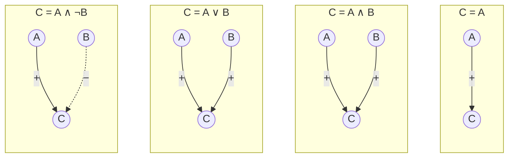

#  Introduction to Artificial Neural Networks
brain neurons inspired ANNs(artificial neural networks)

ANN
ANN Architectures
Multi Layer Perceptrons

So McCulloch and Pitts presented a simplified computational model
of how biological neurons might work together in animal brains to perform complex
computations using propositional logic.
1st ANN


biological neurons are connected to each other, they help to transfer data

hence the paper said an artificial neuron has one or more binary (on/off) inputs and one binary output
n input active=> output activates
example: simple logical computations




## [Perceptrons (1957 by Frank Rosenblatt)](./perceptron.py)
linear threshold unit (LTU): the inputs and output are now numbers
(z = w1 x1 + w2 x2 + ⋯ + wn xn = wT· x)
applies a step function to that sum and outputs the result
hw(x) = step (z) = step (wT·x).

Perceptrons: Single Layer of LTUs, each neuron connected to all inputs
add an extra bias feature(x0=1); represented using a special type of neuron called a bias neuron,

**training:**
when 1 neuron triggers another neuron, their connection strengthens
known as **Hebbs Rule**: the connection weight between two neurons is increased whenever they have the same output.
**Equation 10-2. Perceptron learning rule (weight update)**

$$w_{i,j}^{\text{(next step)}} = w_{i,j} + \eta(\hat{y}_j - y_j) x_i$$

- $w_{i,j}$ is the connection weight between the i-th input neuron and the j-th output neuron.
- $x_i$ is the i-th input value of the current training instance.
- $\hat{y}_j$ is the output of the j-th output neuron for the current training instance.
- $y_j$ is the target output of the j-th output neuron for the current training instance.
- $\eta$ is the learning rate.

Perceptron class that implements a single LTU network
```python
import numpy as np
from sklearn.datasets import load_iris
from sklearn.linear_model import Perceptron
iris = load_iris()
X = iris.data[:, (2, 3)] # petal length, petal width
y = (iris.target == 0).astype(np.int) # Iris Setosa?

per_clf = Perceptron(random_state=42)
per_clf.fit(X, y)
y_pred = per_clf.predict([[2, 0.5]])
```

weakness:
- can't solve XOR

solve by stacking multiple perceptrons to one-another
resulting ANN is called a Multi-Layer Perceptron (MLP).

### MultiLayer Perceptron & BackPropogation
so there are 1 input layer, then multiple hidden layers
atlast has an output layer
Every layer except the output layer includes a bias neuron and is fully connected to the next layer

deep neural network (DNN): ANN has two or more hidden layers

algorithm:
- feed to network
- compute the output of a layer
- measures the network’s output error(desired output-actual output)
- last step: apply gradient descent

need the logistic function to work properly

**Sigmoid:**

$$\sigma(z) = \frac{1}{1 + e^{-z}}$$

**Hyperbolic tangent:**

$$\tanh(z) = 2\sigma(2z) - 1$$

**ReLU (Rectified Linear Unit):**

$$\text{ReLU}(z) = \max(0, z)$$

### Training an [MLP](multi-layer-perceptron.py)
trivial to train a deep neural network with any number of hidden layers, and
a softmax output layer to output estimated class probabilities.
```python
import tensorflow as tf
feature_columns = tf.contrib.learn.infer_real_valued_columns_from_input(X_train)
dnn_clf = tf.contrib.learn.DNNClassifier(hidden_units=[300, 100], n_classes=10,
feature_columns=feature_columns)
dnn_clf.fit(x=X_train, y=y_train, batch_size=50, steps=40000)

# run on MNIST
from sklearn.metrics import accuracy_score
y_pred = list(dnn_clf.predict(X_test))
accuracy_score(y_test, y_pred)  #0.98180000000000001
#eval the model
dnn_clf.evaluate(X_test, y_test)    # {'accuracy': 0.98180002, 'global_step': 40000, 'loss': 0.073678359}
```

### [Training DNN Using Plain TensorFlow](dnn.py)
```python
import tensorflow as tf
n_inputs = 28*28 # MNIST
n_hidden1 = 300
n_hidden2 = 100
n_outputs = 10

X = tf.placeholder(tf.float32, shape=(None, n_inputs), name="X")
y = tf.placeholder(tf.int64, shape=(None), name="y")
```

create 2 hidden layer and output layer
```python
def neuron_layer(X, n_neurons, name, activation=None):
    with tf.name_scope(name):
        n_inputs = int(X.get_shape()[1])
        stddev = 2 / np.sqrt(n_inputs)
        init = tf.truncated_normal((n_inputs, n_neurons), stddev=stddev)
        W = tf.Variable(init, name="weights")
        b = tf.Variable(tf.zeros([n_neurons]), name="biases")
        z = tf.matmul(X, W) + b # create a subgraph to compute z = X · W + b
        if activation=="relu":
            return tf.nn.relu(z)    #call relu
        else:
            return z
```

create neural network:
```python
with tf.name_scope("dnn"):
    hidden1 = neuron_layer(X, n_hidden1, "hidden1", activation="relu")
    hidden2 = neuron_layer(hidden1, n_hidden2, "hidden2", activation="relu")
    logits = neuron_layer(hidden2, n_outputs, "outputs")
```

calculate the mean cross entropy of the algorithm:
```python
with tf.name_scope("loss"):
    xentropy = tf.nn.sparse_softmax_cross_entropy_with_logits(
        labels=y, logits=logits)
    loss = tf.reduce_mean(xentropy, name="loss")
```

GradientDescentOptimizer that will tweak the model parameters to minimize the cost function
```python
learning_rate = 0.01
with tf.name_scope("train"):
    optimizer = tf.train.GradientDescentOptimizer(learning_rate)
    training_op = optimizer.minimize(loss)
```

network accuracy:
```python
with tf.name_scope("eval"):
    correct = tf.nn.in_top_k(logits, y, 1)
    accuracy = tf.reduce_mean(tf.cast(correct, tf.float32))

#save to disk
init = tf.global_variables_initializer()
saver = tf.train.Saver()
```

### Execution
```python
from tensorflow.examples.tutorials.mnist import input_data
mnist = input_data.read_data_sets("/tmp/data/")

n_epochs = 400
batch_size = 50

#train the model
with tf.Session() as sess:
    init.run()
    for epoch in range(n_epochs):
        for iteration in range(mnist.train.num_examples // batch_size):
            X_batch, y_batch = mnist.train.next_batch(batch_size)
            sess.run(training_op, feed_dict={X: X_batch, y: y_batch})
        acc_train = accuracy.eval(feed_dict={X: X_batch, y: y_batch})
        acc_test = accuracy.eval(feed_dict={X: mnist.test.images,y: mnist.test.labels})
        print(epoch, "Train accuracy:", acc_train, "Test accuracy:", acc_test)
    save_path = saver.save(sess, "./my_model_final.ckpt")

#using the neural network
with tf.Session() as sess:
    saver.restore(sess, "./my_model_final.ckpt")
    X_new_scaled = [...] # some new images (scaled from 0 to 1)
    Z = logits.eval(feed_dict={X: X_new_scaled})
    y_pred = np.argmax(Z, axis=1)
```

## Fine-Tuning Neural Network Hyperparameters

**Why hyperparameter tuning is hard**

Neural nets have *tons* of knobs: layers, neurons, activations, initialization, etc.
Grid search is too slow because training is expensive, so **randomized search** is usually better. More advanced tools (like Oscar) can help explore faster.


**1) Number of Hidden Layers**

* You can start with **1 hidden layer** and still model very complex functions *if you add enough neurons*.
* But **deep networks are more efficient**: they can represent complex functions using **far fewer neurons** than shallow nets.
* Real-world data is hierarchical, so deep nets naturally learn:

  * low-level patterns (edges, lines)
  * mid-level patterns (shapes)
  * high-level patterns (faces, objects)

**Bonus of deep nets**

They help **transfer learning**:

* You can reuse lower layers from a trained model (e.g., face recognition) for a related task (e.g., hairstyles).
* This speeds training and reduces required data.

**Practical advice**

* Start with **1–2 layers** for most tasks.
* Increase depth gradually until you start overfitting.
* Very complex tasks may need dozens/hundreds of layers (usually CNNs, not fully connected).


**2) Number of Neurons per Hidden Layer**

* Input/output neurons depend on the task (e.g., MNIST: 784 inputs, 10 outputs).
* A common older idea: use a **funnel shape** (e.g., 300 → 100).
* A simpler modern approach: keep **same size** across layers (e.g., 150 each).

**Rule of thumb**

* Increase neurons/layers until overfitting begins.
* Usually, adding **more layers** helps more than adding more neurons.

**Stretch pants strategy**

Instead of finding the perfect size:

* Build a **bigger model than needed**
* Use **early stopping** + regularization (especially dropout) to prevent overfitting


**3) Activation Functions**

* Hidden layers: **ReLU** (or variants) is usually best

  * faster
  * avoids saturation issues (unlike sigmoid/tanh)
* Output layer:

  * **Softmax** for classification (mutually exclusive classes)
  * **No activation** for regression
