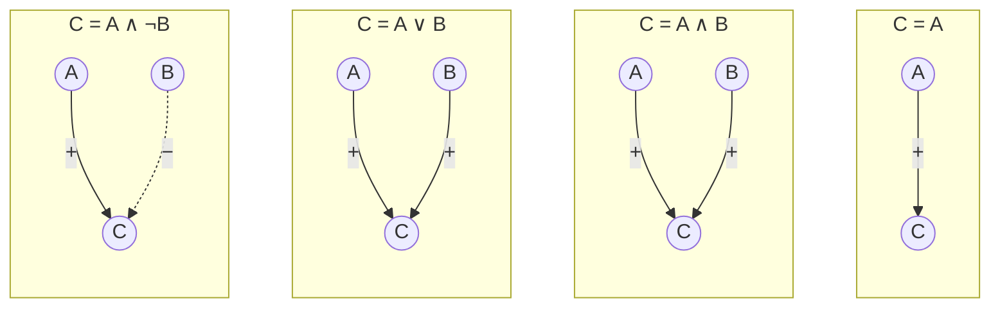

# Neural Networks & Deep Learning

## where it starts

brain neurons inspired ANNs(artificial neural networks)

So McCulloch and Pitts presented a simplified computational model
of how biological neurons might work together in animal brains to perform complex
computations using propositional logic.
1st ANN

biological neurons are connected to each other, they help to transfer data

hence the paper said an artificial neuron has one or more binary (on/off) inputs and one binary output
n input active=> output activates
example: simple logical computations


```mermaid
graph BT
    subgraph "C = A"
        A1((A)) -->|+| C1((C))
    end

    subgraph "C = A ∧ B"
        A2((A)) -->|+| C2((C))
        B2((B)) -->|+| C2
    end

    subgraph "C = A ∨ B"
        A3((A)) -->|+| C3((C))
        B3((B)) -->|+| C3
    end

    subgraph "C = A ∧ ¬B"
        A4((A)) -->|+| C4((C))
        B4((B)) -.->|−| C4
    end
```

cute, but binary on/off is useless for real data. so we relax the rules.

## [Perceptrons (1957 by Frank Rosenblatt)](./perceptron.py)

linear threshold unit (LTU): the inputs and output are now numbers
(z = w1 x1 + w2 x2 + ⋯ + wn xn = wT· x)
applies a step function to that sum and outputs the result
hw(x) = step (z) = step (wT·x).

Perceptrons: Single Layer of LTUs, each neuron connected to all inputs
add an extra bias feature(x0=1); represented using a special type of neuron called a bias neuron,

**training:**

when 1 neuron triggers another neuron, their connection strengthens
known as **Hebbs Rule**: the connection weight between two neurons is increased whenever they have the same output.

but Hebb alone drifts. the actual rule subtracts the target from the prediction:

**Equation 10-2. Perceptron learning rule (weight update)**

$$w_{i,j}^{\text{(next step)}} = w_{i,j} + \eta(\hat{y}_j - y_j) x_i$$

- $w_{i,j}$ is the connection weight between the i-th input neuron and the j-th output neuron.
- $x_i$ is the i-th input value of the current training instance.
- $\hat{y}_j$ is the output of the j-th output neuron for the current training instance.
- $y_j$ is the target output of the j-th output neuron for the current training instance.
- $\eta$ is the learning rate.

Perceptron class that implements a single LTU network

```python
import numpy as np
from sklearn.datasets import load_iris
from sklearn.linear_model import Perceptron
iris = load_iris()
X = iris.data[:, (2, 3)] # petal length, petal width
y = (iris.target == 0).astype(np.int64) # Iris Setosa?

per_clf = Perceptron(random_state=42)
per_clf.fit(X, y)
y_pred = per_clf.predict([[2, 0.5]])
```

**weakness:**

- can't solve XOR

a single layer draws one straight line. XOR needs two. no amount of extra LTUs fixes it — that's a hard limit of the model, not a tuning problem.

solve by stacking multiple perceptrons to one-another
resulting ANN is called a Multi-Layer Perceptron (MLP).

## MultiLayer Perceptron & BackPropagation

so there are 1 input layer, then multiple hidden layers
atlast has an output layer
Every layer except the output layer includes a bias neuron and is fully connected to the next layer

deep neural network (DNN): ANN has two or more hidden layers

**algorithm:**

- feed to network
- compute the output of a layer
- measures the network's output error(desired output-actual output)
- last step: apply gradient descent

that loop repeated is backprop. error flows backwards, gradient descent nudges weights, repeat.

## Building Blocks

### Single Neuron

let's start simple. for the housing price prediction problem, if we want to prevent negative prices, we can use:

$$\bar{h}_\theta(x) = \max(wx + b, 0)$$

where $\theta = (w, b)$ and $\max(t, 0)$ is called **ReLU** (Rectified Linear Unit).

for multi-dimensional input $x \in \mathbb{R}^d$:
$$\bar{h}_\theta(x) = \text{ReLU}(w^T x + b)$$

where $w \in \mathbb{R}^d$, $b \in \mathbb{R}$

**key terms:**

- $b$ = bias
- $w$ = weight vector
- this is a 1-layer network

### Stacking Neurons

now let's get fancy. say we have features: size, bedrooms, zip code, wealth.

we might think:

- family size depends on size + bedrooms
- walkability depends on zip code
- school quality depends on zip code + wealth

so we create intermediate variables (hidden units):
$$a_1 = \text{ReLU}(\theta_1 x_1 + \theta_2 x_2 + \theta_3)$$
$$a_2 = \text{ReLU}(\theta_4 x_3 + \theta_5)$$
$$a_3 = \text{ReLU}(\theta_6 x_3 + \theta_7 x_4 + \theta_8)$$

then combine them:
$$\bar{h}_\theta(x) = \theta_9 a_1 + \theta_{10} a_2 + \theta_{11} a_3 + \theta_{12}$$

but this requires domain knowledge. can we be more general?

### 2-layer Fully-Connected Neural Network

let's make each hidden unit depend on ALL inputs:

$$a_1 = \text{ReLU}(w_1^T x + b_1)$$
$$a_2 = \text{ReLU}(w_2^T x + b_2)$$
$$a_3 = \text{ReLU}(w_3^T x + b_3)$$

then:
$$\bar{h}_\theta(x) = \theta_9 a_1 + \theta_{10} a_2 + \theta_{11} a_3 + \theta_{12}$$

this is a **fully-connected neural network** because all $a_i$'s depend on all $x_i$'s.

this is the fix for XOR too — the hidden layer bends the space so one line becomes enough.

### Vectorization - crucial for efficiency

instead of for loops, we use matrix operations!

define weight matrix $W^{[1]} \in \mathbb{R}^{m \times d}$:
$$W^{[1]} = \begin{bmatrix} - w_1^T - \\ - w_2^T - \\ \vdots \\ - w_m^T - \end{bmatrix}$$

then:
$$z = W^{[1]} x + b^{[1]}$$
$$a = \text{ReLU}(z)$$
$$\bar{h}_\theta(x) = W^{[2]} a + b^{[2]}$$

where $W^{[2]} \in \mathbb{R}^{1 \times m}$ and $b^{[2]} \in \mathbb{R}$

**why vectorization matters:** GPUs can do matrix operations in parallel, making this MUCH faster than for loops!

### Multi-layer Neural Networks

for an $r$-layer network:
$$a^{[1]} = \text{ReLU}(W^{[1]} x + b^{[1]})$$
$$a^{[2]} = \text{ReLU}(W^{[2]} a^{[1]} + b^{[2]})$$
$$\vdots$$
$$a^{[r-1]} = \text{ReLU}(W^{[r-1]} a^{[r-2]} + b^{[r-1]})$$
$$\bar{h}_\theta(x) = W^{[r]} a^{[r-1]} + b^{[r]}$$

**parameters:**

- total neurons: $m_1 + m_2 + ... + m_r$
- total parameters: $(d+1)m_1 + (m_1+1)m_2 + ... + (m_{r-1}+1)m_r$

note: typically no ReLU on the last layer so we can output negative numbers if needed

## Other Activation Functions

**Sigmoid:**

$$\sigma(z) = \frac{1}{1 + e^{-z}}$$

**Hyperbolic tangent:**

$$\tanh(z) = 2\sigma(2z) - 1$$

**ReLU:**

$$\text{ReLU}(z) = \max(0, z)$$

**Leaky ReLU:**

$$\sigma(z) = \max\{z, \gamma z\}, \quad \gamma \in (0,1)$$

**GELU** (used in GPT, BERT):

$$\sigma(z) = \frac{z}{2}\left[1 + \text{erf}\left(\frac{z}{\sqrt{2}}\right)\right]$$

**SoftPlus:**

$$\sigma(z) = \frac{1}{\beta}\log(1 + \exp(\beta z)), \quad \beta > 0$$

sigmoid and tanh saturate — gradients vanish at the ends, so deep nets learn badly. ReLU doesn't, which is why it won.

**why not identity $\sigma(z) = z$?**

if we used $\sigma(z) = z$, then:
$$\bar{h}_\theta(x) = W^{[2]} a^{[1]} = W^{[2]} W^{[1]} x = \tilde{W} x$$

it collapses to just linear regression! we need non-linearity to capture complex patterns.

## Connection to kernel methods

remember feature maps from kernel methods? we can view neural networks similarly:

let $\beta$ = all parameters except the last layer. then:
$$a^{[r-1]} = \phi_\beta(x)$$

and:
$$\bar{h}_\theta(x) = W^{[r]} \phi_\beta(x) + b^{[r]}$$

so we're learning BOTH:

- a good feature representation $\phi_\beta(x)$ (the penultimate layer)
- a linear model on top of those features

this is why deep learning needs less domain knowledge - it learns good features automatically!

the penultimate layer $a^{[r-1]}$ is often called the **learned features** or **representations**. these can even transfer to other tasks!

## Training an [MLP](multi-layer-perceptron.py)

trivial to train a deep neural network with any number of hidden layers, and
a softmax output layer to output estimated class probabilities.

### Training DNN Using Plain TensorFlow

[dnn.py](./dnn.py) builds it by hand — layer fn, loss, optimizer, eval, all in separate name scopes so you can inspect the graph.

```python
import tensorflow as tf
n_inputs = 28*28 # MNIST
n_hidden1 = 300
n_hidden2 = 100
n_outputs = 10

X = tf.placeholder(tf.float32, shape=(None, n_inputs), name="X")
y = tf.placeholder(tf.int64, shape=(None), name="y")
```

create 2 hidden layer and output layer

```python
def neuron_layer(X, n_neurons, name, activation=None):
    with tf.name_scope(name):
        n_inputs = int(X.get_shape()[1])
        stddev = 2 / np.sqrt(n_inputs)
        init = tf.truncated_normal((n_inputs, n_neurons), stddev=stddev)
        W = tf.Variable(init, name="weights")
        b = tf.Variable(tf.zeros([n_neurons]), name="biases")
        z = tf.matmul(X, W) + b # create a subgraph to compute z = X · W + b
        if activation=="relu":
            return tf.nn.relu(z)    #call relu
        else:
            return z
```

create neural network:

```python
with tf.name_scope("dnn"):
    hidden1 = neuron_layer(X, n_hidden1, "hidden1", activation="relu")
    hidden2 = neuron_layer(hidden1, n_hidden2, "hidden2", activation="relu")
    logits = neuron_layer(hidden2, n_outputs, "outputs")
```

calculate the mean cross entropy of the algorithm:

```python
with tf.name_scope("loss"):
    xentropy = tf.nn.sparse_softmax_cross_entropy_with_logits(
        labels=y, logits=logits)
    loss = tf.reduce_mean(xentropy, name="loss")
```

GradientDescentOptimizer that will tweak the model parameters to minimize the cost function

```python
learning_rate = 0.01
with tf.name_scope("train"):
    optimizer = tf.train.GradientDescentOptimizer(learning_rate)
    training_op = optimizer.minimize(loss)
```

network accuracy:

```python
with tf.name_scope("eval"):
    correct = tf.nn.in_top_k(logits, y, 1)
    accuracy = tf.reduce_mean(tf.cast(correct, tf.float32))

#save to disk
init = tf.global_variables_initializer()
saver = tf.train.Saver()
```

### Execution

```python
from tensorflow.examples.tutorials.mnist import input_data
mnist = input_data.read_data_sets("/tmp/data/")

n_epochs = 400
batch_size = 50

#train the model
with tf.Session() as sess:
    init.run()
    for epoch in range(n_epochs):
        for iteration in range(mnist.train.num_examples // batch_size):
            X_batch, y_batch = mnist.train.next_batch(batch_size)
            sess.run(training_op, feed_dict={X: X_batch, y: y_batch})
        acc_train = accuracy.eval(feed_dict={X: X_batch, y: y_batch})
        acc_test = accuracy.eval(feed_dict={X: mnist.test.images,y: mnist.test.labels})
        print(epoch, "Train accuracy:", acc_train, "Test accuracy:", acc_test)
    save_path = saver.save(sess, "./my_model_final.ckpt")

#using the neural network
with tf.Session() as sess:
    saver.restore(sess, "./my_model_final.ckpt")
    X_new_scaled = [...] # some new images (scaled from 0 to 1)
    Z = logits.eval(feed_dict={X: X_new_scaled})
    y_pred = np.argmax(Z, axis=1)
```

result on MNIST: **98.2% accuracy**, loss 0.074.

## Fine-Tuning Neural Network Hyperparameters

**Why hyperparameter tuning is hard**

Neural nets have _tons_ of knobs: layers, neurons, activations, initialization, etc.
Grid search is too slow because training is expensive, so **randomized search** is usually better. More advanced tools (Keras Tuner, Optuna) can explore faster.

**1) Number of Hidden Layers**

- You can start with **1 hidden layer** and still model very complex functions _if you add enough neurons_.
- But **deep networks are more efficient**: they can represent complex functions using **far fewer neurons** than shallow nets.
- Real-world data is hierarchical, so deep nets naturally learn:

  - low-level patterns (edges, lines)
  - mid-level patterns (shapes)
  - high-level patterns (faces, objects)

**Bonus of deep nets**

They help **transfer learning**:

- You can reuse lower layers from a trained model (e.g., face recognition) for a related task (e.g., hairstyles).
- This speeds training and reduces required data.

**Practical advice**

- Start with **1–2 layers** for most tasks.
- Increase depth gradually until you start overfitting.
- Very complex tasks may need dozens/hundreds of layers (usually CNNs, not fully connected).

**2) Number of Neurons per Hidden Layer**

- Input/output neurons depend on the task (e.g., MNIST: 784 inputs, 10 outputs).
- A common older idea: use a **funnel shape** (e.g., 300 → 100).
- A simpler modern approach: keep **same size** across layers (e.g., 150 each).

**Rule of thumb**

- Increase neurons/layers until overfitting begins.
- Usually, adding **more layers** helps more than adding more neurons.

**Stretch pants strategy**

Instead of finding the perfect size:

- Build a **bigger model than needed**
- Use **early stopping** + regularization (especially dropout) to prevent overfitting

**3) Activation Functions**

- Hidden layers: **ReLU** (or variants) is usually best

  - faster
  - avoids saturation issues (unlike sigmoid/tanh)

- Output layer:

  - **Softmax** for classification (mutually exclusive classes)
  - **No activation** for regression

# Key Takeaways

> The perceptron was the first learnable neuron — and its XOR failure is what created the entire deep learning field.

> Stacking neurons is the whole trick. One layer = a line, two layers = enough to bend space.

> Every layer before the last is a feature map. Deep learning just learns $\phi$ instead of hand-designing it.

> No ReLU = no depth. Without non-linearity the whole stack collapses back into one linear model.

> Vectorization isn't a nice-to-have, it's the reason this trains in seconds instead of hours.