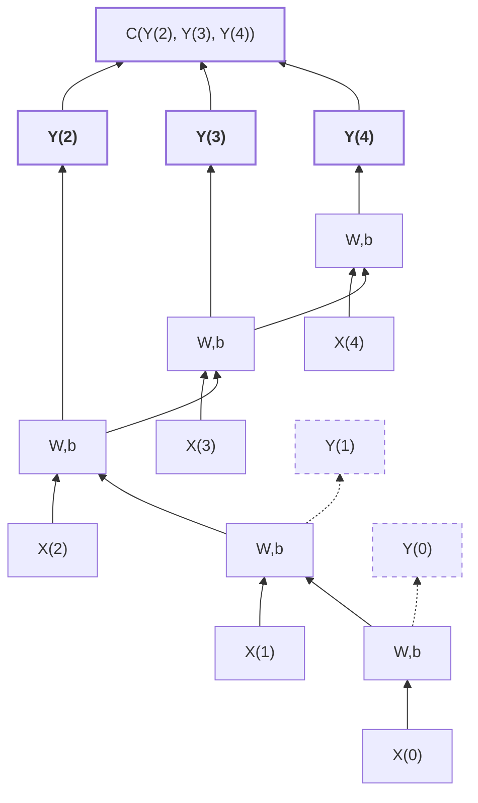
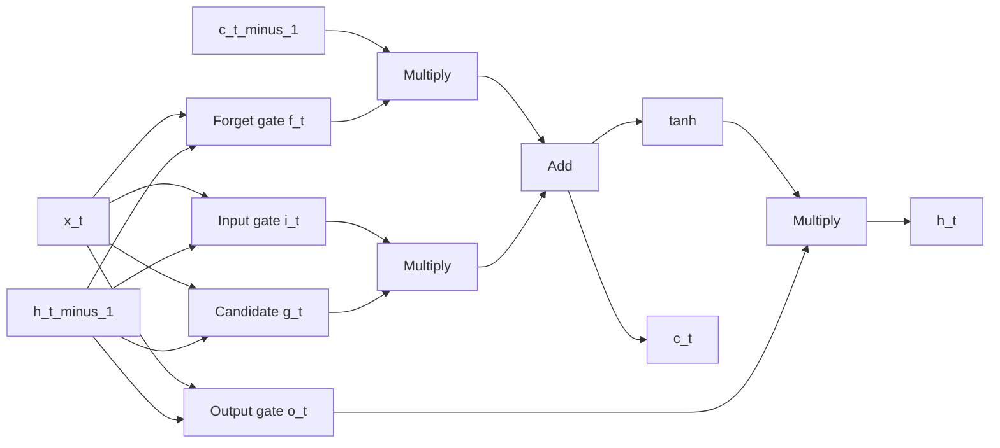
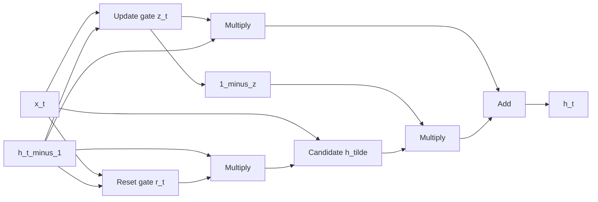

# Recurrent Neural Networks

A class of nets that can predict the future (well, up to a point, of course).
They can analyze time series data such as stock prices, and tell you when to buy or sell.

# Recurrent Neurons

recurrent neural network looks very much like a
feedforward neural network, except it also has connections pointing backward.

simplest rnn: just one neuron receiving inputs, producing an output, and sending that output back to itself

At each time step t (also called a frame), this recurrent neuron receives the inputs x(t) as well as its own output from the previous time step, y(t–1)
known as unrolling the network through time

2 set of weights: one for the inputs x(t); one for the outputs of the previous time step, y(t–1)

b is the bias term and ϕ(·) is the activation function, e.g., ReLU

Equation 14-1: Output of a single recurrent neuron for a single instance
$y_{(t)} = \phi(x_{(t)}^T \cdot w_x + y_{(t-1)}^T \cdot w_y + b)$

Equation 14-2: Outputs of a layer of recurrent neurons for all instances in a mini-batch
$Y_{(t)} = \phi(X_{(t)} \cdot W_x + Y_{(t-1)} \cdot W_y + b)$

$= \phi([X_{(t)} \quad Y_{(t-1)}] \cdot W + b)$ with $W = \begin{bmatrix} W_x \\ W_y \end{bmatrix}$

- $Y_{(t)}$ is an $m \times n_{\text{neurons}}$ matrix containing the layer's outputs at time step $t$ for each instance in the mini-batch ($m$ is the number of instances in the mini-batch and $n_{\text{neurons}}$ is the number of neurons).
- $X_{(t)}$ is an $m \times n_{\text{inputs}}$ matrix containing the inputs for all instances ($n_{\text{inputs}}$ is the number of input features).
- $W_x$ is an $n_{\text{inputs}} \times n_{\text{neurons}}$ matrix containing the connection weights for the inputs of the current time step.
- $W_y$ is an $n_{\text{neurons}} \times n_{\text{neurons}}$ matrix containing the connection weights for the outputs of the previous time step.
- The weight matrices $W_x$ and $W_y$ are often concatenated into a single weight matrix $W$ of shape $(n_{\text{inputs}} + n_{\text{neurons}}) \times n_{\text{neurons}}$.
- $b$ is a vector of size $n_{\text{neurons}}$ containing each neuron's bias term.

**Memory :** since based on previous output, hence sort of memory created
**Memory Cell:** A part of a neural network that preserves some state across time steps

**Input & Output Sequences:**

1. **Sequence-to-Sequence:** Takes a sequence of inputs and produces a sequence of outputs (e.g., predicting time series like stock prices — feed prices over last N days, output prices shifted by one day into the future).
2. **Sequence-to-Vector:** Feed a sequence of inputs, ignore all outputs except the last one (e.g., feed a movie review as a sequence of words, network outputs a sentiment score from –1 [hate] to +1 [love]).
3. **Vector-to-Sequence:** Feed a single input at the first time step (zeros for all others), and let it output a sequence (e.g., input an image, output a caption for that image).
4. **Encoder–Decoder:** A sequence-to-vector network (encoder) followed by a vector-to-sequence network (decoder) (e.g., machine translation — encoder converts a sentence into a single vector representation, decoder converts that vector into a sentence in another language).
5. **Why Encoder–Decoder over Seq-to-Seq for translation:** Last words of a sentence can affect the first words of the translation, so you need to wait until you have heard the whole sentence before translating — a single seq-to-seq RNN translating on the fly can't handle this well.

# [Basic RNN in Tensorflow](./rnn-scratch.py)

RNN composed of a layer of five recurrent neuron with tanh function

```python
n_inputs = 3
n_neurons = 5
X0 = tf.placeholder(tf.float32, [None, n_inputs])
X1 = tf.placeholder(tf.float32, [None, n_inputs])
Wx = tf.Variable(tf.random_normal(shape=[n_inputs, n_neurons],dtype=tf.float32))
Wy = tf.Variable(tf.random_normal(shape=[n_neurons,n_neurons],dtype=tf.float32))
b = tf.Variable(tf.zeros([1, n_neurons], dtype=tf.float32))
Y0 = tf.tanh(tf.matmul(X0, Wx) + b)
Y1 = tf.tanh(tf.matmul(Y0, Wy) + tf.matmul(X1, Wx) + b)
init = tf.global_variables_initializer()

import numpy as np
# Mini-batch: instance 0,instance 1,instance 2,instance 3
X0_batch = np.array([[0, 1, 2], [3, 4, 5], [6, 7, 8], [9, 0, 1]]) # t = 0
X1_batch = np.array([[9, 8, 7], [0, 0, 0], [6, 5, 4], [3, 2, 1]]) # t = 1
with tf.Session() as sess:
    init.run()
    Y0_val, Y1_val = sess.run([Y0, Y1], feed_dict={X0: X0_batch, X1: X1_batch})

print(Y0_val)

print(Y1_val)
```

```
[[-0.2964572 0.82874775 -0.34216955 -0.75720584 0.19011548] # instance 0
[-0.12842922 0.99981797 0.84704727 -0.99570125 0.38665548] # instance 1
[ 0.04731077 0.99999976 0.99330056 -0.999933 0.55339795] # instance 2
[ 0.70323634 0.99309105 0.99909431 -0.85363263 0.7472108 ]] # instance 3

[[ 0.51955646 1. 0.99999022 -0.99984968 -0.24616946] # instance 0
[-0.70553327 -0.11918639 0.48885304 0.08917919 -0.26579669] # instance 1
[-0.32477224 0.99996376 0.99933046 -0.99711186 0.10981458] # instance 2
[-0.43738723 0.91517633 0.97817528 -0.91763324 0.11047263]] # instance 3
```

## Static Unrolling Through Time

- `static_rnn()` creates an unrolled RNN by chaining cells — one copy of the cell per time step, all sharing weights and biases.
- It takes a cell factory (e.g., `BasicRNNCell`) and a list of input tensors (one per time step), returns a list of output tensors + the final state.
- For many time steps, use `tf.transpose()` + `tf.unstack()` to convert a single input tensor `[None, n_steps, n_inputs]` into a list of per-step tensors, and `tf.stack()` + `tf.transpose()` to merge outputs back.
- **Drawback:** builds one cell per time step in the graph — for 50 steps the graph is huge, can cause OOM errors during backpropagation (especially on GPU).

## Dynamic Unrolling Through Time

- `dynamic_rnn()` uses a `while_loop()` operation to iterate over time steps — no need to unroll the graph.
- Accepts a single input tensor `[None, n_steps, n_inputs]` and outputs a single tensor `[None, n_steps, n_neurons]` — no stack/unstack/transpose needed.
- Set `swap_memory=True` to swap GPU memory to CPU during backpropagation to avoid OOM errors.
- `while_loop()` stores tensor values per iteration during the forward pass and uses them for gradient computation in the reverse pass.
- **Preferred over static unrolling** — cleaner, memory-efficient, and handles variable-length sequences.

```python
X = tf.placeholder(tf.float32, [None, n_steps, n_inputs])
basic_cell = tf.contrib.rnn.BasicRNNCell(num_units=n_neurons)
outputs, states = tf.nn.dynamic_rnn(basic_cell, X, dtype=tf.float32)
```

## Handling Variable Length Input Sequences

input sequences have variable lengths
We should set the sequence_length parameter when calling the dynamic_rnn() (or
static_rnn()) function;
it must be a 1D tensor indicating the length of the input sequence for each instance

```python
seq_length = tf.placeholder(tf.int32, [None])
[...]
outputs, states = tf.nn.dynamic_rnn(basic_cell, X, dtype=tf.float32, sequence_length=seq_length)

X_batch = np.array([
# step 0    step 1
[[0, 1, 2], [9, 8, 7]], # instance 0
[[3, 4, 5], [0, 0, 0]], # instance 1 (padded with a zero vector)- to fit in the input tensor X
[[6, 7, 8], [6, 5, 4]], # instance 2
[[9, 0, 1], [3, 2, 1]], # instance 3
])
seq_length_batch = np.array([2, 1, 2, 2])

#feed values for both placeholders X and seq_length
with tf.Session() as sess:
    init.run()
    outputs_val, states_val = sess.run(
        [outputs, states], feed_dict={X: X_batch, seq_length: seq_length_batch})
```

# Training RNN

_backpropagation through time (BPTT)_: unroll it through time (like we just did) and then simply use regular backpropagation

first forward pass through the unrolled
network (represented by the dashed arrows); then the output sequence is evaluated
using a cost function C(Y(t min),Y(t min+1)....Y(t max))

cost function is computed using the last three outputs of the net‐
work, Y(2), Y(3), and Y(4), so gradients flow through these three outputs, but not
through Y(0) and Y(1).
Moreover, since the same parameters W and b are used at each time step, backpropagation will do the right thing and sum over all time steps.



## [Training Sequence Classifier](./rnn-sequence-classifier.py)

rnn on MNIST images
treat each image as a sequence of 28 rows of 28 pixels each

use cells of 150 recurrent neurons, plus a fully connected layer containing 10 neurons (one per class) connected to the output of the last time step, followed by a softmax layer

```python
from tensorflow.contrib.layers import fully_connected
n_steps = 28
n_inputs = 28
n_neurons = 150
n_outputs = 10
learning_rate = 0.001
X = tf.placeholder(tf.float32, [None, n_steps, n_inputs])
y = tf.placeholder(tf.int32, [None])
basic_cell = tf.contrib.rnn.BasicRNNCell(num_units=n_neurons)
outputs, states = tf.nn.dynamic_rnn(basic_cell, X, dtype=tf.float32)
logits = fully_connected(states, n_outputs, activation_fn=None)
xentropy = tf.nn.sparse_softmax_cross_entropy_with_logits(labels=y, logits=logits)
loss = tf.reduce_mean(xentropy)
optimizer = tf.train.AdamOptimizer(learning_rate=learning_rate)
training_op = optimizer.minimize(loss)
correct = tf.nn.in_top_k(logits, y, 1)
accuracy = tf.reduce_mean(tf.cast(correct, tf.float32))
init = tf.global_variables_initializer()

#import data and test it
from tensorflow.examples.tutorials.mnist import input_data
mnist = input_data.read_data_sets("/tmp/data/")
X_test = mnist.test.images.reshape((-1, n_steps, n_inputs))
y_test = mnist.test.labels

#execution phase
n_epochs = 100
batch_size = 150
with tf.Session() as sess:
    init.run()
    for epoch in range(n_epochs):
        for iteration in range(mnist.train.num_examples // batch_size):
            X_batch, y_batch = mnist.train.next_batch(batch_size)
            X_batch = X_batch.reshape((-1, n_steps, n_inputs))
            sess.run(training_op, feed_dict={X: X_batch, y: y_batch})
        acc_train = accuracy.eval(feed_dict={X: X_batch, y: y_batch})
        acc_test = accuracy.eval(feed_dict={X: X_test, y: y_test})
        print(epoch, "Train accuracy:", acc_train, "Test accuracy:", acc_test)
```

## [Training to Predict Time Series(Stocks etc)](./time-series-pred.py)

train an RNN to predict the next value in a generated time series.

training instance: randomly selected sequence of 20 consecutive values from the time series

target sequence: same as input sequence but shifted by one time step into the future

now we have like 100 vector size output, but we want only one, so we use a `OutputProjectionWrapper`
proxies every method call to an underlying cell, but it also adds some functionality.
it adds a fully connected layer of linear neurons on top of each output

```python
cell = tf.contrib.rnn.OutputProjectionWrapper(
tf.contrib.rnn.BasicRNNCell(num_units=n_neurons, activation=tf.nn.relu),
output_size=n_outputs)

#adam optimiser, training op, and the variable initialization op
learning_rate = 0.001
loss = tf.reduce_mean(tf.square(outputs - y))
optimizer = tf.train.AdamOptimizer(learning_rate=learning_rate)
training_op = optimizer.minimize(loss)
init = tf.global_variables_initializer()

#execution
n_iterations = 10000
batch_size = 50
with tf.Session() as sess:
    init.run()
    for iteration in range(n_iterations):
        X_batch, y_batch = [...] # fetch the next training batch
        sess.run(training_op, feed_dict={X: X_batch, y: y_batch})
            if iteration % 100 == 0:
                mse = loss.eval(feed_dict={X: X_batch, y: y_batch})
                print(iteration,"\tMSE:", mse)

#prediction
X_new = [...] # New sequences
y_pred = sess.run(outputs, feed_dict={X: X_new})
```

easy solution, but not efficient

efficient: reshape the RNN outputs from `[batch_size, n_steps, n_neurons]`
to `[batch_size * n_steps, n_neurons]`, then apply a single fully connected layer
with the appropriate output size

result in an output tensor of shape `[batch_size * n_steps, n_outputs]`
reshape it then to `[batch_size, n_steps, n_outputs]`.

```python
# revert to a basic cell
cell = tf.contrib.rnn.BasicRNNCell(num_units=n_neurons, activation=tf.nn.relu)
rnn_outputs, states = tf.nn.dynamic_rnn(cell, X, dtype=tf.float32)

# stack all output
stacked_rnn_outputs = tf.reshape(rnn_outputs, [-1, n_neurons])

#apply fully connected linear layer
stacked_outputs = fully_connected(stacked_rnn_outputs, n_output,
activation_fn=None)

# finally unstack all the outputs
outputs = tf.reshape(stacked_outputs, [-1, n_steps, n_outputs])
```

## Creative RNN

generate some creative sequences

need to:

1. provide it a seed sequence containing n_steps values (e.g., full of zeros),
2. predict the next value, append this predicted value to the sequence,
3. feed the last n_steps values to the model to predict the next value,
4. repeat 1 to 3

```python
sequence = [0.] * n_steps
for iteration in range(300):
    X_batch = np.array(sequence[-n_steps:]).reshape(1, n_steps, 1)
    y_pred = sess.run(outputs, feed_dict={X: X_batch})
    sequence.append(y_pred[0,-1, 0])
```

# Deep RNN

to stack multiple layers of cells,

```python
n_neurons = 100
n_layers = 3
basic_cell = tf.contrib.rnn.BasicRNNCell(num_units=n_neurons)
multi_layer_cell = tf.contrib.rnn.MultiRNNCell([basic_cell] * n_layers)
outputs, states = tf.nn.dynamic_rnn(multi_layer_cell, X, dtype=tf.float32)
```

## Deep RNN across GPUs

```python
with tf.device("/gpu:0"): # BAD! This is ignored.
    layer1 = tf.contrib.rnn.BasicRNNCell(num_units=n_neurons)
with tf.device("/gpu:1"): # BAD! Ignored again.
    layer2 = tf.contrib.rnn.BasicRNNCell(num_units=n_neurons)
```

fails because a BasicRNNCell is a cell factory, not a cell per se (as mentioned earlier);
no cells get created when you create the factory, and thus no variables do either.

dynamic_rnn calls MultiRNNCell, which calls individual BasicRNNCell, creating actual cells

hence need to create own cell wrapper

```python
import tensorflow as tf
class DeviceCellWrapper(tf.contrib.rnn.RNNCell):
    def __init__(self, device, cell):
        self._cell = cell
        self._device = device

    @property
    def state_size(self):
        return self._cell.state_size

    @property
    def output_size(self):
        return self._cell.output_size

    def __call__(self, inputs, state, scope=None):
        with tf.device(self._device):
            return self._cell(inputs, state, scope)

#distribute each layer across gpu
devices = ["/gpu:0", "/gpu:1", "/gpu:2"]
cells = [DeviceCellWrapper(dev,tf.contrib.rnn.BasicRNNCell(num_units=n_neurons))
for dev in devices]
multi_layer_cell = tf.contrib.rnn.MultiRNNCell(cells)
outputs, states = tf.nn.dynamic_rnn(multi_layer_cell, X, dtype=tf.float32)
```

## Applying Dropout

to basically overcome overfitting

add dropout layer before or after

```python
#drop each input with 50% probability
keep_prob = 0.5
cell = tf.contrib.rnn.BasicRNNCell(num_units=n_neurons)
cell_drop = tf.contrib.rnn.DropoutWrapper(cell, input_keep_prob=keep_prob)
multi_layer_cell = tf.contrib.rnn.MultiRNNCell([cell_drop] * n_layers)
rnn_outputs, states = tf.nn.dynamic_rnn(multi_layer_cell, X, dtype=tf.float32)
```

doesn;t supports is_training placeholder, so need to either write your own or 2 diff graphs: one for training, and the other for testing

```python
#trainign & testing
mport sys
is_training = (sys.argv[-1] == "train")
X = tf.placeholder(tf.float32, [None, n_steps, n_inputs])
y = tf.placeholder(tf.float32, [None, n_steps, n_outputs])
cell = tf.contrib.rnn.BasicRNNCell(num_units=n_neurons)
if is_training:
    cell = tf.contrib.rnn.DropoutWrapper(cell, input_keep_prob=keep_prob)
multi_layer_cell = tf.contrib.rnn.MultiRNNCell([cell] * n_layers)
rnn_outputs, states = tf.nn.dynamic_rnn(multi_layer_cell, X, dtype=tf.float32)
[...] # build the rest of the graph
init = tf.global_variables_initializer()
saver = tf.train.Saver()

with tf.Session() as sess:
    if is_training:
        init.run()
        for iteration in range(n_iterations):
            [...] # train the model
        save_path = saver.save(sess, "/tmp/my_model.ckpt")
    else:
        saver.restore(sess, "/tmp/my_model.ckpt")
        [...] # use the mode
```

---

# [LSTM Cell](./lstm.py)

Long Short-Term Memory (LSTM) cell was proposed in 1997
faster training, better performance & long term dependency detection

```python
lstm_cell = tf.contrib.rnn.BasicLSTMCell(num_units=n_neurons)
```



looks exactly like normal cell, except split into 2 vectors:h(t) and c(t) (“c” stands for “cell”)
h(t) as the short-term state and c(t) as the long-term state.

c(t–1) traverses the network from left to right
c(t) is result sent straight, each time new memories are added and previous old are dropped

the long-term state is copied and passed through the tanh function, and then the result is filtered by the output gate

### Core Components

An LSTM cell has:

- **Main layer (candidate layer)** → outputs `g(t)`
- **3 Gates (sigmoid controllers)**:
  - Forget gate → `f(t)`
  - Input gate → `i(t)`
  - Output gate → `o(t)`

States:

- Short-term state → `h(t)`
- Long-term state → `c(t)`

### What Each Part Does

**Main Layer (g(t))**

- Computes candidate memory
- Uses `tanh`
- Analyzes:
  - current input `x(t)`
  - previous short-term state `h(t-1)`

- Output is **not directly exposed**
- It is **filtered before being stored**

**Gates (All use sigmoid → values in [0,1])**

They control information flow via element-wise multiplication.

**Forget Gate — `f(t)`**

- Controls what to erase from long-term memory
- If 0 → erase
- If 1 → keep

[
c(t) ← f(t) ⊙ c(t-1)
]

**Input Gate — `i(t)`**

- Controls what part of `g(t)` gets stored
- Decides how much new info to write

[
c(t) ← c(t) + i(t) ⊙ g(t)
]

**Output Gate — `o(t)`**

- Controls what part of memory to expose
- Filters long-term memory before output

[
h(t) = o(t) ⊙ tanh(c(t))
]

### Full Memory Update Equation

[
c(t) = f(t) ⊙ c(t-1) + i(t) ⊙ g(t)
]

This is the heart of LSTM.

### Why LSTM Works (Intuition)

LSTM can:

1. **Detect important info** → Input gate
2. **Store it in long-term memory** → `c(t)`
3. **Keep it for long time** → Forget gate
4. **Use it when needed** → Output gate

This solves **vanishing gradient problem** and enables long-term dependencies.

> LSTM = Controlled memory system with read, write, and erase operations.

## Peephole Connection

the previous long-term state c(t–1) is added as an
input to the controllers of the forget gate and the input gate, and the current long-
term state c(t) is added as input to the controller of the output gate.

`lstm_cell = tf.contrib.rnn.LSTMCell(num_units=n_neurons, use_peepholes=True)`

---

# GRU Cell



simplified version of LSTM; simplifications are:
• Both state vectors are merged into a single vector h(t).
• A single gate controller controls both the forget gate and the input gate. If the
gate controller outputs a 1, the input gate is open and the forget gate is closed. If
it outputs a 0, the opposite happens. In other words, whenever a memory must
be stored, the location where it will be stored is erased first. This is actually a fre‐
quent variant to the LSTM cell in and of itself.
• There is no output gate; the full state vector is output at every time step. How‐
ever, there is a new gate controller that controls which part of the previous state
will be shown to the main layer.

[$
r_t = sigmoid(Wr x_t + Ur h_t-1)
z_t = sigmoid(Wz x_t + Uz h_t-1)
$]

[$
h_tilde = tanh(Wh x_t + Uh (r_t * h_t-1))
$]

[$
h_t = z_t * h_t-1 + (1 - z_t) * h_tilde
$]

# Natural Language Processing

machine learnong models to translate

## Word Embeddings

why not one hot vector

If vocabulary size = 50,000

Word = `"milk"`

Representation:

```
[0, 0, 0, ..., 1, ..., 0]  (50,000 dimensions)
```

Problems:

- Huge (50k dimensions per word)
- Sparse (almost all zeros)
- No similarity information

In one-hot:

- “milk” and “water” are completely unrelated vectors
- Distance between any two different words is the same

So the model **cannot generalize meaning**.

we want to:

- Similar words → similar vectors
- Dissimilar words → far apart vectors

Example:

If the model learns:

> “I drink milk” is valid

Then if:

- milk ≈ water
- milk ≠ shoes

It can infer:

- ✅ “I drink water”
- ❌ “I drink shoes”

That’s semantic understanding.

**Solution: Word Embeddings**
Instead of 50,000-dimensional sparse vector:

Use:

- 150-dimensional dense vector (for example)
- Filled with real numbers

So:

```
milk → [0.12, -0.88, 0.45, ...]
water → [0.10, -0.91, 0.43, ...]
shoes → [0.77, 0.12, -0.55, ...]
```

Now:

- milk is numerically close to water
- milk is far from shoes

### How Are Embeddings Learned?

At start:

- Random values
- No meaning

During training:

- Backpropagation updates embeddings
- If two words behave similarly in sentences → their vectors move closer
- If not → they move apart

The network **learns meaning automatically**.

### Interesting Property

Embeddings often organize along interpretable directions:

Some vector directions represent:

- Gender (king – man + woman ≈ queen)
- Singular vs plural
- Verb tense
- Noun vs adjective

This emerges naturally from training.

### What TensorFlow Code Is Doing

**Step 1: Create embedding matrix**

```python
embeddings = tf.Variable(
    tf.random_uniform([50000, 150], -1.0, 1.0)
)
```

This creates:

A matrix of size:

```
[ vocabulary_size × embedding_size ]
= [ 50000 × 150 ]
```

Think of it as:

| word_id | embedding vector |
| ------- | ---------------- |
| 0       | 150 numbers      |
| 1       | 150 numbers      |
| ...     | ...              |
| 49999   | 150 numbers      |

**Step 2: Convert sentence to word IDs**

“I drink milk”

Becomes:

```
[72, 3335, 288]
```

Each number = index in vocabulary.

**Step 3: Lookup embeddings**

```python
embed = tf.nn.embedding_lookup(embeddings, train_inputs)
```

This just means:

> For each word ID, fetch its 150-dimensional vector.

No heavy computation.
Just fancy indexing.

### Why Pretrained Embeddings?

Instead of learning from scratch, you can download:

- Word2Vec
- GloVe
- FastText

They already learned semantic relationships from massive text.

You have two options:

**Option A — Freeze them**

- Faster training
- Less overfitting
- No modification

**Option B — Fine-tune them**

- Slightly better performance
- Slower
- Task-specific adaptation

### Big Picture Intuition

One-hot = identity
Embedding = meaning

One-hot says:

> “This is word #288.”

Embedding says:

> “This word behaves like other liquid-related nouns.”

That’s why embeddings are powerful.

