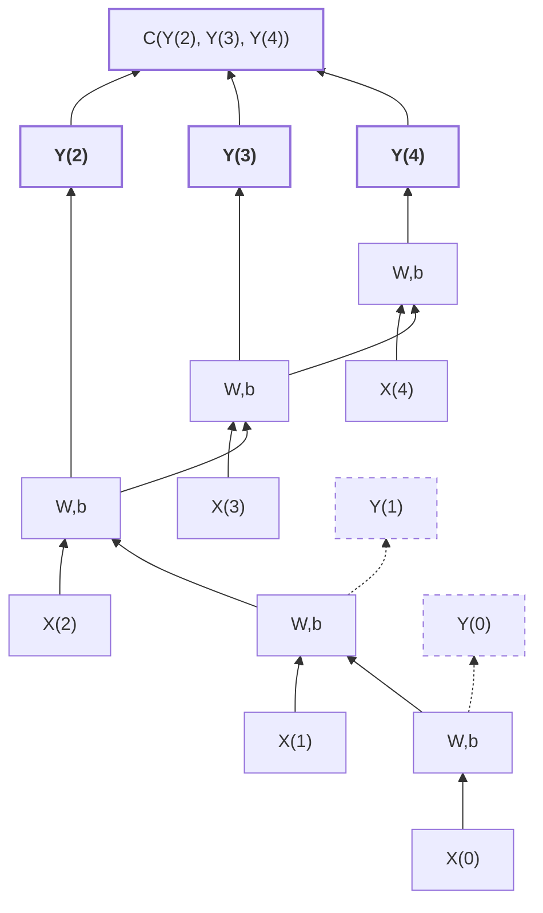

# Recurrent Neural Networks
A class of nets that can predict the future (well, up to a point, of course). 
They can analyze time series data such as stock prices, and tell you when to buy or sell. 

# Recurrent Neurons
recurrent neural network looks very much like a
feedforward neural network, except it also has connections pointing backward.

simplest rnn: just one neuron receiving inputs, producing an output, and sending that output back to itself

At each time step t (also called a frame), this recurrent neuron receives the inputs x(t) as well as its own output from the previous time step, y(t–1)
known as unrolling the network through time

2 set of weights: one for the inputs x(t); one for the outputs of the previous time step, y(t–1)

b is the bias term and ϕ(·) is the activation function, e.g., ReLU

Equation 14-1: Output of a single recurrent neuron for a single instance
$y_{(t)} = \phi(x_{(t)}^T \cdot w_x + y_{(t-1)}^T \cdot w_y + b)$

Equation 14-2: Outputs of a layer of recurrent neurons for all instances in a mini-batch
$Y_{(t)} = \phi(X_{(t)} \cdot W_x + Y_{(t-1)} \cdot W_y + b)$

$= \phi([X_{(t)} \quad Y_{(t-1)}] \cdot W + b)$ with $W = \begin{bmatrix} W_x \\ W_y \end{bmatrix}$

- $Y_{(t)}$ is an $m \times n_{\text{neurons}}$ matrix containing the layer's outputs at time step $t$ for each instance in the mini-batch ($m$ is the number of instances in the mini-batch and $n_{\text{neurons}}$ is the number of neurons).
- $X_{(t)}$ is an $m \times n_{\text{inputs}}$ matrix containing the inputs for all instances ($n_{\text{inputs}}$ is the number of input features).
- $W_x$ is an $n_{\text{inputs}} \times n_{\text{neurons}}$ matrix containing the connection weights for the inputs of the current time step.
- $W_y$ is an $n_{\text{neurons}} \times n_{\text{neurons}}$ matrix containing the connection weights for the outputs of the previous time step.
- The weight matrices $W_x$ and $W_y$ are often concatenated into a single weight matrix $W$ of shape $(n_{\text{inputs}} + n_{\text{neurons}}) \times n_{\text{neurons}}$.
- $b$ is a vector of size $n_{\text{neurons}}$ containing each neuron's bias term.

**Memory :** since based on previous output, hence sort of memory created
**Memory Cell:** A part of a neural network that preserves some state across time steps

**Input & Output Sequences:**
1. **Sequence-to-Sequence:** Takes a sequence of inputs and produces a sequence of outputs (e.g., predicting time series like stock prices — feed prices over last N days, output prices shifted by one day into the future).
2. **Sequence-to-Vector:** Feed a sequence of inputs, ignore all outputs except the last one (e.g., feed a movie review as a sequence of words, network outputs a sentiment score from –1 [hate] to +1 [love]).
3. **Vector-to-Sequence:** Feed a single input at the first time step (zeros for all others), and let it output a sequence (e.g., input an image, output a caption for that image).
4. **Encoder–Decoder:** A sequence-to-vector network (encoder) followed by a vector-to-sequence network (decoder) (e.g., machine translation — encoder converts a sentence into a single vector representation, decoder converts that vector into a sentence in another language).
5. **Why Encoder–Decoder over Seq-to-Seq for translation:** Last words of a sentence can affect the first words of the translation, so you need to wait until you have heard the whole sentence before translating — a single seq-to-seq RNN translating on the fly can't handle this well.


# Basic RNN in Tensorflow
RNN composed of a layer of five recurrent neuron with tanh function
```python
n_inputs = 3
n_neurons = 5
X0 = tf.placeholder(tf.float32, [None, n_inputs])
X1 = tf.placeholder(tf.float32, [None, n_inputs])
Wx = tf.Variable(tf.random_normal(shape=[n_inputs, n_neurons],dtype=tf.float32))
Wy = tf.Variable(tf.random_normal(shape=[n_neurons,n_neurons],dtype=tf.float32))
b = tf.Variable(tf.zeros([1, n_neurons], dtype=tf.float32))
Y0 = tf.tanh(tf.matmul(X0, Wx) + b)
Y1 = tf.tanh(tf.matmul(Y0, Wy) + tf.matmul(X1, Wx) + b)
init = tf.global_variables_initializer()

import numpy as np
# Mini-batch: instance 0,instance 1,instance 2,instance 3
X0_batch = np.array([[0, 1, 2], [3, 4, 5], [6, 7, 8], [9, 0, 1]]) # t = 0
X1_batch = np.array([[9, 8, 7], [0, 0, 0], [6, 5, 4], [3, 2, 1]]) # t = 1
with tf.Session() as sess:
    init.run()
    Y0_val, Y1_val = sess.run([Y0, Y1], feed_dict={X0: X0_batch, X1: X1_batch})

print(Y0_val)

print(Y1_val)
```

```
[[-0.2964572 0.82874775 -0.34216955 -0.75720584 0.19011548] # instance 0
[-0.12842922 0.99981797 0.84704727 -0.99570125 0.38665548] # instance 1
[ 0.04731077 0.99999976 0.99330056 -0.999933 0.55339795] # instance 2
[ 0.70323634 0.99309105 0.99909431 -0.85363263 0.7472108 ]] # instance 3

[[ 0.51955646 1. 0.99999022 -0.99984968 -0.24616946] # instance 0
[-0.70553327 -0.11918639 0.48885304 0.08917919 -0.26579669] # instance 1
[-0.32477224 0.99996376 0.99933046 -0.99711186 0.10981458] # instance 2
[-0.43738723 0.91517633 0.97817528 -0.91763324 0.11047263]] # instance 3
```

## Static Unrolling Through Time
- `static_rnn()` creates an unrolled RNN by chaining cells — one copy of the cell per time step, all sharing weights and biases.
- It takes a cell factory (e.g., `BasicRNNCell`) and a list of input tensors (one per time step), returns a list of output tensors + the final state.
- For many time steps, use `tf.transpose()` + `tf.unstack()` to convert a single input tensor `[None, n_steps, n_inputs]` into a list of per-step tensors, and `tf.stack()` + `tf.transpose()` to merge outputs back.
- **Drawback:** builds one cell per time step in the graph — for 50 steps the graph is huge, can cause OOM errors during backpropagation (especially on GPU).

## Dynamic Unrolling Through Time
- `dynamic_rnn()` uses a `while_loop()` operation to iterate over time steps — no need to unroll the graph.
- Accepts a single input tensor `[None, n_steps, n_inputs]` and outputs a single tensor `[None, n_steps, n_neurons]` — no stack/unstack/transpose needed.
- Set `swap_memory=True` to swap GPU memory to CPU during backpropagation to avoid OOM errors.
- `while_loop()` stores tensor values per iteration during the forward pass and uses them for gradient computation in the reverse pass.
- **Preferred over static unrolling** — cleaner, memory-efficient, and handles variable-length sequences.

```python
X = tf.placeholder(tf.float32, [None, n_steps, n_inputs])
basic_cell = tf.contrib.rnn.BasicRNNCell(num_units=n_neurons)
outputs, states = tf.nn.dynamic_rnn(basic_cell, X, dtype=tf.float32)
```

## Handling Variable Length Input Sequences
input sequences have variable lengths
We should set the sequence_length parameter when calling the dynamic_rnn() (or
static_rnn()) function; 
it must be a 1D tensor indicating the length of the input sequence for each instance

```python
seq_length = tf.placeholder(tf.int32, [None])
[...]
outputs, states = tf.nn.dynamic_rnn(basic_cell, X, dtype=tf.float32, sequence_length=seq_length)

X_batch = np.array([
# step 0    step 1
[[0, 1, 2], [9, 8, 7]], # instance 0
[[3, 4, 5], [0, 0, 0]], # instance 1 (padded with a zero vector)- to fit in the input tensor X
[[6, 7, 8], [6, 5, 4]], # instance 2
[[9, 0, 1], [3, 2, 1]], # instance 3
])
seq_length_batch = np.array([2, 1, 2, 2])

#feed values for both placeholders X and seq_length
with tf.Session() as sess:
    init.run()
    outputs_val, states_val = sess.run(
        [outputs, states], feed_dict={X: X_batch, seq_length: seq_length_batch})
```

# Training RNN
*backpropagation through time (BPTT)*: unroll it through time (like we just did) and then simply use regular backpropagation

first forward pass through the unrolled
network (represented by the dashed arrows); then the output sequence is evaluated
using a cost function C(Y(t min),Y(t min+1)....Y(t max))


cost function is computed using the last three outputs of the net‐
work, Y(2), Y(3), and Y(4), so gradients flow through these three outputs, but not
through Y(0) and Y(1). 
Moreover, since the same parameters W and b are used at each time step, backpropagation will do the right thing and sum over all time steps.



## Training Sequence Classifier
rnn on MNIST images
treat each image as a sequence of 28 rows of 28 pixels each 

use cells of 150 recurrent neurons, plus a fully connected layer containing 10 neurons (one per class) connected to the output of the last time step, followed by a softmax layer

```python
from tensorflow.contrib.layers import fully_connected
n_steps = 28
n_inputs = 28
n_neurons = 150
n_outputs = 10
learning_rate = 0.001
X = tf.placeholder(tf.float32, [None, n_steps, n_inputs])
y = tf.placeholder(tf.int32, [None])
basic_cell = tf.contrib.rnn.BasicRNNCell(num_units=n_neurons)
outputs, states = tf.nn.dynamic_rnn(basic_cell, X, dtype=tf.float32)
logits = fully_connected(states, n_outputs, activation_fn=None)
xentropy = tf.nn.sparse_softmax_cross_entropy_with_logits(labels=y, logits=logits)
loss = tf.reduce_mean(xentropy)
optimizer = tf.train.AdamOptimizer(learning_rate=learning_rate)
training_op = optimizer.minimize(loss)
correct = tf.nn.in_top_k(logits, y, 1)
accuracy = tf.reduce_mean(tf.cast(correct, tf.float32))
init = tf.global_variables_initializer()

#import data and test it
from tensorflow.examples.tutorials.mnist import input_data
mnist = input_data.read_data_sets("/tmp/data/")
X_test = mnist.test.images.reshape((-1, n_steps, n_inputs))
y_test = mnist.test.labels

#execution phase
n_epochs = 100
batch_size = 150
with tf.Session() as sess:
    init.run()
    for epoch in range(n_epochs):
        for iteration in range(mnist.train.num_examples // batch_size):
            X_batch, y_batch = mnist.train.next_batch(batch_size)
            X_batch = X_batch.reshape((-1, n_steps, n_inputs))
            sess.run(training_op, feed_dict={X: X_batch, y: y_batch})
        acc_train = accuracy.eval(feed_dict={X: X_batch, y: y_batch})
        acc_test = accuracy.eval(feed_dict={X: X_test, y: y_test})
        print(epoch, "Train accuracy:", acc_train, "Test accuracy:", acc_test)
```

## Training to Predict Time Series(Stocks etc)
rain an RNN to predict the next value in a generated time series.

401-433