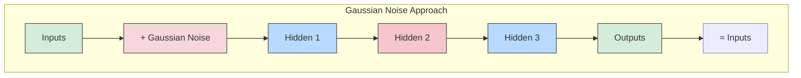
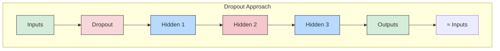

# Autoencoders

1. **They learn without labels (unsupervised learning).**
   Autoencoders train by trying to copy input → output, so they don’t need labeled data.

2. **They compress data into a smaller representation (coding).**
   The network squeezes input into a lower-dimensional form, which helps in **dimensionality reduction** and feature extraction.

3. **Constraints make them useful.**
   By limiting the internal size or adding noise, the model can’t just copy data directly — it must learn meaningful patterns, and it can even generate new similar data (generative model).

# Efficient Data Representations

• 40, 27, 25, 36, 81, 57, 10, 73, 19, 68
• 50, 25, 76, 38, 19, 58, 29, 88, 44, 22, 11, 34, 17, 52, 26, 13, 40, 20

1. At first glance, the shorter number sequence seems easier to memorize.

2. The longer sequence is actually easier if you notice its pattern (hailstone sequence rule: even → half, odd → 3×n + 1).

3. Recognizing patterns makes memorization easier.

4. Humans rely on pattern recognition because memory is limited.

5. Chess experts remember board positions easily only when the positions follow real game patterns.

6. Experts don’t have better memory — they recognize patterns better.

7. Autoencoders work similarly: they learn patterns to store data efficiently.

8. An autoencoder has two parts:
   - **Encoder** → compresses input into a smaller internal representation.
   - **Decoder** → reconstructs the original input from that representation.

9. The output layer has the same number of neurons as the input layer because it tries to copy the input.

10. In an **undercomplete autoencoder** (smaller hidden layer), the model cannot simply copy inputs — it must learn the most important features and ignore unnecessary details.

# [Performing PCA with an Undercomplete Linear Autoencoder](./pca-linear-autoencoder.py)

If the autoencoder uses only linear activations and the cost function is the Mean
Squared Error (MSE), then it ends up performing Principal Component Analysis

```python
import tensorflow as tf
from tensorflow.contrib.layers import fully_connected

n_inputs = 3 # 3D inputs
n_hidden = 2 # 2D codings

n_outputs = n_inputs

learning_rate = 0.01

X = tf.placeholder(tf.float32, shape=[None, n_inputs])
hidden = fully_connected(X, n_hidden, activation_fn=None)
outputs = fully_connected(hidden, n_outputs, activation_fn=None)

reconstruction_loss = tf.reduce_mean(tf.square(outputs - X)) # MSE

optimizer = tf.train.AdamOptimizer(learning_rate)
training_op = optimizer.minimize(reconstruction_loss)

init = tf.global_variables_initializer()
```

things to note:

- The number of outputs is equal to the number of inputs.
- To perform simple PCA, we set activation_fn=None (i.e., all neurons are linear) and the cost function is the MSE.

```python
#applying it
X_train, X_test = [...] # load the dataset

n_iterations = 1000
codings = hidden # the output of the hidden layer provides the codings

with tf.Session() as sess:
    init.run()
    for iteration in range(n_iterations):
        training_op.run(feed_dict={X: X_train}) # no labels (unsupervised)
    codings_val = codings.eval(feed_dict={X: X_test})
```

# [Stacked Autoencoder](./stacked-autoencoder.py)

autoencoders can have multiple hidden layers. In this case they are called stacked autoencoders (or deep autoencoders).

architecture: typically symmetrical with regards to the central hidden layer (the coding layer).

```mermaid
flowchart TB
    A[Inputs\n784 units] --> B[Hidden 1\n300 units]
    B --> C[Hidden 2 (Codings)\n150 units]
    C --> D[Hidden 3\n300 units]
    D --> E[Outputs\n784 units\n(Reconstructions ≈ Inputs)]
```

**Implementation**

```python
# stacked autoencoder for MNIST,
# using He initialization, the ELU activation function, and ℓ2 regularization.
n_inputs = 28 * 28 # for MNIST
n_hidden1 = 300
n_hidden2 = 150 # codings
n_hidden3 = n_hidden1
n_outputs = n_inputs

learning_rate = 0.01
l2_reg = 0.001

X = tf.placeholder(tf.float32, shape=[None, n_inputs])
with tf.contrib.framework.arg_scope(
[fully_connected],
activation_fn=tf.nn.elu,
weights_initializer=tf.contrib.layers.variance_scaling_initializer(),
weights_regularizer=tf.contrib.layers.l2_regularizer(l2_reg)):
hidden1 = fully_connected(X, n_hidden1)
hidden2 = fully_connected(hidden1, n_hidden2) # codings
hidden3 = fully_connected(hidden2, n_hidden3)
outputs = fully_connected(hidden3, n_outputs, activation_fn=None)

reconstruction_loss = tf.reduce_mean(tf.square(outputs - X)) # MSE


reg_losses = tf.get_collection(tf.GraphKeys.REGULARIZATION_LOSSES)
loss = tf.add_n([reconstruction_loss] + reg_losses)
optimizer = tf.train.AdamOptimizer(learning_rate)
training_op = optimizer.minimize(loss)
init = tf.global_variables_initializer()


#trainig the model
n_epochs = 5
batch_size = 150
with tf.Session() as sess:
    init.run()
    for epoch in range(n_epochs):
        n_batches = mnist.train.num_examples // batch_size
        for iteration in range(n_batches):
            X_batch, y_batch = mnist.train.next_batch(batch_size)
            sess.run(training_op, feed_dict={X: X_batch})
```

**Tying Weights:**
autoencoder has a total of N layers (not
counting the input layer), and WL represents the connection weights of the Lth layer
then the decoder layer weights can be defined simply as: WN–L+1 = WL
T

```python
activation = tf.nn.elu
regularizer = tf.contrib.layers.l2_regularizer(l2_reg)
initializer = tf.contrib.layers.variance_scaling_initializer()
X = tf.placeholder(tf.float32, shape=[None, n_inputs])
weights1_init = initializer([n_inputs, n_hidden1])
weights2_init = initializer([n_hidden1, n_hidden2])
weights1 = tf.Variable(weights1_init, dtype=tf.float32, name="weights1")
weights2 = tf.Variable(weights2_init, dtype=tf.float32, name="weights2")
weights3 = tf.transpose(weights2, name="weights3") # tied weights
weights4 = tf.transpose(weights1, name="weights4") # tied weights
biases1 = tf.Variable(tf.zeros(n_hidden1), name="biases1")
biases2 = tf.Variable(tf.zeros(n_hidden2), name="biases2")
biases3 = tf.Variable(tf.zeros(n_hidden3), name="biases3")
biases4 = tf.Variable(tf.zeros(n_outputs), name="biases4")
hidden1 = activation(tf.matmul(X, weights1) + biases1)
hidden2 = activation(tf.matmul(hidden1, weights2) + biases2)
hidden3 = activation(tf.matmul(hidden2, weights3) + biases3)
outputs = tf.matmul(hidden3, weights4) + biases4
reconstruction_loss = tf.reduce_mean(tf.square(outputs - X))
reg_loss = regularizer(weights1) + regularizer(weights2)
loss = reconstruction_loss + reg_loss
optimizer = tf.train.AdamOptimizer(learning_rate)
training_op = optimizer.minimize(loss)
init = tf.global_variables_initializer()
```

**Training One Autoencoder at a Time**

Rather than training the whole stacked autoencoder in one go, it is often much faster to train one shallow autoencoder at a time, then stack all of them into a single stacked autoencoder (hence the name). This is especially useful for very deep autoencoders.

During the first phase of training, the first autoencoder learns to reconstruct the inputs. During the second phase, the second autoencoder learns to reconstruct the output of the first autoencoder's hidden layer. Finally, you just build a big sandwich using all these autoencoders (i.e., you first stack the hidden layers of each autoencoder, then the output layers in reverse order). This gives you the final stacked autoencoder. You could easily train more autoencoders this way, building a very deep stacked autoencoder.

To implement this multiphase training algorithm, the simplest approach is to use a different TensorFlow graph for each phase. After training an autoencoder, you just run the training set through it and capture the output of the hidden layer. This output then serves as the training set for the next autoencoder. Once all autoencoders have been trained this way, you simply copy the weights and biases from each autoencoder and use them to build the stacked autoencoder.

Another approach is to use a single graph containing the whole stacked autoencoder, plus some extra operations to perform each training phase:

- The central column in the graph is the full stacked autoencoder. This part can be used after training.
- The left column is the set of operations needed to run the first phase of training. It creates an output layer that bypasses hidden layers 2 and 3. This output layer shares the same weights and biases as the stacked autoencoder's output layer. On top of that are the training operations that will aim at making the output as close as possible to the inputs. Thus, this phase will train the weights and biases for the hidden layer 1 and the output layer (i.e., the first autoencoder).
- The right column in the graph is the set of operations needed to run the second phase of training. It adds the training operation that will aim at making the output of hidden layer 3 as close as possible to the output of hidden layer 1. Note that we must freeze hidden layer 1 while running phase 2. This phase will train the weights and biases for hidden layers 2 and 3 (i.e., the second autoencoder).

The TensorFlow code looks like this:

```python
# [...] Build the whole stacked autoencoder normally.
# In this example, the weights are not tied.

optimizer = tf.train.AdamOptimizer(learning_rate)

with tf.name_scope("phase1"):
    phase1_outputs = tf.matmul(hidden1, weights4) + biases4
    phase1_reconstruction_loss = tf.reduce_mean(tf.square(phase1_outputs - X))
    phase1_reg_loss = regularizer(weights1) + regularizer(weights4)
    phase1_loss = phase1_reconstruction_loss + phase1_reg_loss
    phase1_training_op = optimizer.minimize(phase1_loss)

with tf.name_scope("phase2"):
    phase2_reconstruction_loss = tf.reduce_mean(tf.square(hidden3 - hidden1))
    phase2_reg_loss = regularizer(weights2) + regularizer(weights3)
    phase2_loss = phase2_reconstruction_loss + phase2_reg_loss
    train_vars = [weights2, biases2, weights3, biases3]
    phase2_training_op = optimizer.minimize(phase2_loss, var_list=train_vars)
```

The first phase is rather straightforward: we just create an output layer that skips hidden layers 2 and 3, then build the training operations to minimize the distance between the outputs and the inputs (plus some regularization).

The second phase just adds the operations needed to minimize the distance between the output of hidden layer 3 and hidden layer 1 (also with some regularization). Most importantly, we provide the list of trainable variables to the `minimize()` method, making sure to leave out `weights1` and `biases1`; this effectively freezes hidden layer 1 during phase 2.

During the execution phase, all you need to do is run the phase 1 training op for a number of epochs, then the phase 2 training op for some more epochs.

> **Note:** Since hidden layer 1 is frozen during phase 2, its output will always be the same for any given training instance. To avoid having to recompute the output of hidden layer 1 at every single epoch, you can compute it for the whole training set at the end of phase 1, then directly feed the cached output of hidden layer 1 during phase 2. This can give you a nice performance boost.


**Visualizing the Reconstructions**
```python
n_test_digits = 2
X_test = mnist.test.images[:n_test_digits]

with tf.Session() as sess:
    [...] # Train the Autoencoder
    outputs_val = outputs.eval(feed_dict={X: X_test})

def plot_image(image, shape=[28, 28]):
    plt.imshow(image.reshape(shape), cmap="Greys", interpolation="nearest")
    plt.axis("off")

for digit_index in range(n_test_digits):
    plt.subplot(n_test_digits, 2, digit_index * 2 + 1)
    plot_image(X_test[digit_index])
    plt.subplot(n_test_digits, 2, digit_index * 2 + 2)
    plot_image(outputs_val[digit_index])
```

**Visualising Features**
For each neuron in the first hidden layer, you can cre‐
ate an image where a pixel’s intensity corresponds to the weight of the connection to the given neuron.
```python
with tf.Session() as sess:
    [...] # train autoencoder
    weights1_val = weights1.eval()

for i in range(5):
    plt.subplot(1, 5, i + 1)
    plot_image(weights1_val.T[i])
```

# Denoising Autoencoders

add noise to its inputs, training it to recover the original, noise-free inputs.
prevents the autoen‐
coder from trivially copying its inputs to its outputs, so it ends up having to find patterns in the data.



### Denoising Autoencoder with Dropout


```python
X = tf.placeholder(tf.float32, shape=[None, n_inputs])
X_noisy = X + tf.random_normal(tf.shape(X))
[...]
hidden1 = activation(tf.matmul(X_noisy, weights1) + biases1)
[...]
reconstruction_loss = tf.reduce_mean(tf.square(outputs - X)) # MSE
[...]

#dropout version
from tensorflow.contrib.layers import dropout
keep_prob = 0.7
is_training = tf.placeholder_with_default(False, shape=(), name='is_training')
X = tf.placeholder(tf.float32, shape=[None, n_inputs])
X_drop = dropout(X, keep_prob, is_training=is_training)
[...]
hidden1 = activation(tf.matmul(X_drop, weights1) + biases1)
[...]
reconstruction_loss = tf.reduce_mean(tf.square(outputs - X)) # MSE
[...]
sess.run(training_op, feed_dict={X: X_batch, is_training: True})
```

# [Sparse Autoencoders](./sparse-autoencoder.py)

- Sparsity constraint leads to good feature extraction by pushing the autoencoder to reduce the number of active neurons in the coding layer (e.g., only ~5% significantly active).
- This forces the autoencoder to represent each input as a combination of a small number of activations, so each neuron typically ends up representing a useful feature.
- To favor sparse models, measure the actual sparsity by computing the average activation of each neuron in the coding layer over the whole training batch (batch size must not be too small).
- Penalize neurons that are too active by adding a sparsity loss to the cost function (e.g., if average activation is 0.3 but target is 0.1, the neuron must be penalized).
- In practice, using **Kullback–Leibler (KL) divergence** works better than squared error, as it has much stronger gradients than MSE.

```python
def kl_divergence(p, q):
    return p * tf.log(p / q) + (1 - p) * tf.log((1 - p) / (1 - q))

learning_rate = 0.01
sparsity_target = 0.1
sparsity_weight = 0.2

[...] # Build a normal autoencoder (in this example the coding layer is hidden1)

optimizer = tf.train.AdamOptimizer(learning_rate)

hidden1_mean = tf.reduce_mean(hidden1, axis=0) # batch mean
sparsity_loss = tf.reduce_sum(kl_divergence(sparsity_target, hidden1_mean))
reconstruction_loss = tf.reduce_mean(tf.square(outputs - X)) # MSE
loss = reconstruction_loss + sparsity_weight * sparsity_loss
training_op = optimizer.minimize(loss)

logits = tf.matmul(hidden1, weights2) + biases2
outputs = tf.nn.sigmoid(logits)
reconstruction_loss = tf.reduce_sum(
    tf.nn.sigmoid_cross_entropy_with_logits(labels=X, logits=logits))
```

# [Variational AutoEncoders](./variational-autoencoders.py)

- Introduced in 2014 by Diederik Kingma and Max Welling; they are **probabilistic autoencoders** — outputs are partly determined by chance even after training.
- They are **generative autoencoders**, capable of generating new instances that look like they were sampled from the training set (similar to RBMs but easier to train and faster to sample).
- Instead of producing a coding directly, the encoder outputs a **mean μ** and **standard deviation σ**; the actual coding is then sampled from a Gaussian distribution $\mathcal{N}(\mu, \sigma)$.
- The decoder takes this randomly sampled coding and reconstructs the output, which should resemble the original training instance.
- The cost function includes a **latent loss** (KL divergence) that pushes the encoder to produce codings that look like a Gaussian distribution, enabling smooth generative sampling.
```python
n_inputs = 28 * 28 # for MNIST
n_hidden1 = 500
n_hidden2 = 500
n_hidden3 = 20 # codings
n_hidden4 = n_hidden2
n_hidden5 = n_hidden1
n_outputs = n_inputs
learning_rate = 0.001
with tf.contrib.framework.arg_scope(
[fully_connected],
activation_fn=tf.nn.elu,
weights_initializer=tf.contrib.layers.variance_scaling_initializer()):
    X = tf.placeholder(tf.float32, [None, n_inputs])
    hidden1 = fully_connected(X, n_hidden1)
    hidden2 = fully_connected(hidden1, n_hidden2)
    hidden3_mean = fully_connected(hidden2, n_hidden3, activation_fn=None)
    hidden3_gamma = fully_connected(hidden2, n_hidden3, activation_fn=None)
    hidden3_sigma = tf.exp(0.5 * hidden3_gamma)
    noise = tf.random_normal(tf.shape(hidden3_sigma), dtype=tf.float32)
    hidden3 = hidden3_mean + hidden3_sigma * noise
    hidden4 = fully_connected(hidden3, n_hidden4)
    hidden5 = fully_connected(hidden4, n_hidden5)
    logits = fully_connected(hidden5, n_outputs, activation_fn=None)
    outputs = tf.sigmoid(logits)

reconstruction_loss = tf.reduce_sum(
tf.nn.sigmoid_cross_entropy_with_logits(labels=X, logits=logits))
latent_loss = 0.5 * tf.reduce_sum(
tf.exp(hidden3_gamma) + tf.square(hidden3_mean) - 1 - hidden3_gamma)
cost = reconstruction_loss + latent_loss
optimizer = tf.train.AdamOptimizer(learning_rate=learning_rate)
training_op = optimizer.minimize(cost)
init = tf.global_variables_initializer()
```

**Generating Digits**
```python
import numpy as np
n_digits = 60
n_epochs = 50
batch_size = 150
with tf.Session() as sess:
    init.run()
    for epoch in range(n_epochs):
        n_batches = mnist.train.num_examples // batch_size
        for iteration in range(n_batches):
            X_batch, y_batch = mnist.train.next_batch(batch_size)
            sess.run(training_op, feed_dict={X: X_batch})
            codings_rnd = np.random.normal(size=[n_digits, n_hidden3])
            outputs_val = outputs.eval(feed_dict={hidden3: codings_rnd})

for iteration in range(n_digits):
    plt.subplot(n_digits, 10, iteration + 1)
    plot_image(outputs_val[iteration])
```