# Reinforcement Learning

One of the most exciting (and oldest) fields of ML — around since the 1950s.
Key milestones: TD-Gammon (backgammon), DeepMind's Atari player (2013), AlphaGo beating Lee Sedol (2016).
DeepMind applied Deep Learning to RL and it worked beyond expectations. Acquired by Google for $500M+ in 2014.

This chapter covers:
- Learning to optimize rewards
- Policy search (brute force, genetic algorithms, policy gradients)
- OpenAI Gym
- Neural network policies
- Credit assignment problem
- Policy Gradients (REINFORCE)
- Markov Decision Processes (MDP)
- Temporal Difference Learning & Q-Learning
- Deep Q-Networks (DQN)
- Training an agent to play Ms. Pac-Man

---

## Learning to Optimize Rewards

A software **agent** makes **observations** and takes **actions** within an **environment**, receiving **rewards** in return.
Objective: learn to act in a way that maximizes expected **long-term rewards** (trial and error).

Positive rewards = pleasure, negative rewards = pain.

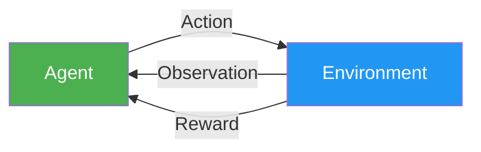

### Examples

| Example | Agent | Environment | Actions | Observations | Rewards |
|---------|-------|-------------|---------|--------------|---------|
| Walking Robot | Control program | Real world | Motor signals | Camera, touch sensors | +ve near target, -ve for wrong dir/fall |
| Ms. Pac-Man | Game AI | Atari simulation | 9 joystick positions | Screenshots | Game points |
| Go Player | Game AI | Board game | Stone placements | Board state | Win/loss |
| Thermostat | Smart controller | Room | Temp adjustments | Temperature readings | +ve near target & saving energy |
| Stock Trader | Trading bot | Stock market | Buy/sell amounts | Price data | Monetary gains/losses |

Note: there may not be any positive rewards at all — e.g., an agent in a maze getting -1 at every step → must find the exit ASAP.

---

## Policy Search

The algorithm the agent uses to determine its actions is called its **policy**.

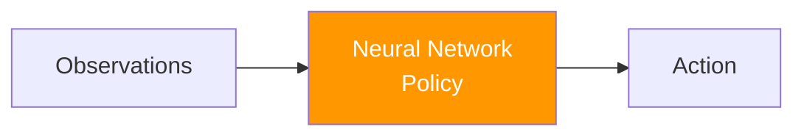

A policy can be any algorithm — it doesn't have to be deterministic.

**Stochastic policy example:** robotic vacuum cleaner
- Move forward with probability _p_, randomly rotate with probability _1 − p_
- Rotation angle: random between _−r_ and _+r_
- Two parameters to tweak: _p_ and _r_

### Policy Search Approaches

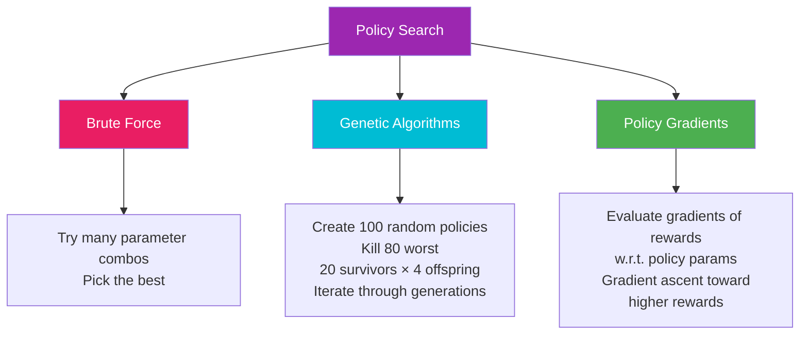

1. **Brute force:** try many parameter values, pick the best — like searching for a needle in a haystack when policy space is large
2. **Genetic algorithms:** evolve policies over generations — create, evaluate, kill worst, breed survivors with random variation
3. **Policy gradients (PG):** follow gradient toward higher rewards (gradient ascent) — most powerful approach

---

## Introduction to OpenAI Gym

OpenAI Gym provides simulated environments (Atari games, board games, 2D/3D physics, etc.) to train and benchmark RL agents.

```bash
pip3 install --upgrade gym
```

### [CartPole Environment](./cartpole-basic.py)

A 2D simulation: accelerate a cart left/right to balance a pole on top.

Each observation = 1D NumPy array of 4 floats:
1. Cart horizontal position (0.0 = center)
2. Cart velocity
3. Pole angle (0.0 = vertical)
4. Pole angular velocity

```python
import gym
env = gym.make("CartPole-v0")
obs = env.reset()            # returns first observation
env.render()                 # displays the environment

env.action_space             # Discrete(2) → 0=left, 1=right

action = 1                   # accelerate right
obs, reward, done, info = env.step(action)
# reward=1.0 at every step (goal: keep running as long as possible)
# done=True when pole tilts too much → must env.reset()
```

### Hardcoded Basic Policy

Accelerate left when pole leans left, right when it leans right:

```python
def basic_policy(obs):
    angle = obs[2]
    return 0 if angle < 0 else 1

totals = []
for episode in range(500):
    episode_rewards = 0
    obs = env.reset()
    for step in range(1000):
        action = basic_policy(obs)
        obs, reward, done, info = env.step(action)
        episode_rewards += reward
        if done:
            break
    totals.append(episode_rewards)

import numpy as np
print(np.mean(totals), np.std(totals), np.min(totals), np.max(totals))
# ~42 mean, max ~68 — not great, cart oscillates till pole falls
```

---

## Neural Network Policies

A neural network that takes observations as input and outputs the **probability** of each action.
For CartPole: one output neuron → probability _p_ of going left; probability _1 − p_ of going right.
Action is **randomly sampled** based on these probabilities (not hardcoded to the highest).

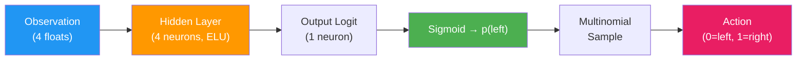

**Why random sampling?** Exploration–exploitation balance:
- Like trying dishes at a new restaurant — if one is good, increase its probability, but don't set it to 100% or you'll never discover better options.

**Note:** CartPole observations are noise-free and contain full state → no need to consider past observations.

### [Neural Network Policy — TensorFlow](./nn-policy-cartpole.py)

```python
import tensorflow as tf
from tensorflow.contrib.layers import fully_connected

n_inputs = 4
n_hidden = 4
n_outputs = 1  # probability of left
initializer = tf.contrib.layers.variance_scaling_initializer()

X = tf.placeholder(tf.float32, shape=[None, n_inputs])
hidden = fully_connected(X, n_hidden, activation_fn=tf.nn.elu,
                         weights_initializer=initializer)
logits = fully_connected(hidden, n_outputs, activation_fn=None,
                         weights_initializer=initializer)
outputs = tf.nn.sigmoid(logits)           # p(left)
p_left_and_right = tf.concat(axis=1, values=[outputs, 1 - outputs])
action = tf.multinomial(tf.log(p_left_and_right), num_samples=1)

init = tf.global_variables_initializer()
```

- Sigmoid → outputs probability [0,1]
- `multinomial()` → randomly picks action based on log-probabilities
- If >2 actions → use softmax instead of sigmoid

---

## Evaluating Actions: The Credit Assignment Problem

In RL, the only guidance is through rewards — which are **sparse and delayed**.
When the agent gets a reward, it's hard to know which actions should get credited or blamed → **credit assignment problem**.

### Discounted Rewards

Evaluate each action by the sum of all future rewards, applying a **discount rate** $\gamma$ at each step:

$$\text{score}(a_t) = r_t + \gamma \cdot r_{t+1} + \gamma^2 \cdot r_{t+2} + \cdots$$

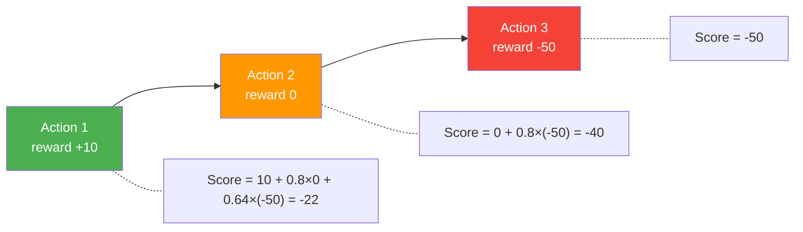

- $\gamma$ close to 0 → only immediate rewards matter
- $\gamma$ close to 1 → far future rewards count almost equally
- $\gamma = 0.95$ → rewards 13 steps ahead count ~half ($0.95^{13} \approx 0.5$)
- $\gamma = 0.99$ → rewards 69 steps ahead count ~half ($0.99^{69} \approx 0.5$)
- CartPole → $\gamma = 0.95$ is reasonable (fairly short-term effects)

After many episodes, **normalize** action scores (subtract mean, divide by std) → positive scores = good actions, negative = bad.

### [Discount Reward Functions](./policy-gradient-cartpole.py)

```python
def discount_rewards(rewards, discount_rate):
    discounted_rewards = np.empty(len(rewards))
    cumulative_rewards = 0
    for step in reversed(range(len(rewards))):
        cumulative_rewards = rewards[step] + cumulative_rewards * discount_rate
        discounted_rewards[step] = cumulative_rewards
    return discounted_rewards

def discount_and_normalize_rewards(all_rewards, discount_rate):
    all_discounted_rewards = [discount_rewards(rewards, discount_rate)
                              for rewards in all_rewards]
    flat_rewards = np.concatenate(all_discounted_rewards)
    reward_mean = flat_rewards.mean()
    reward_std = flat_rewards.std()
    return [(discounted_rewards - reward_mean) / reward_std
            for discounted_rewards in all_discounted_rewards]

# Example:
# discount_rewards([10, 0, -50], discount_rate=0.8) → [-22, -40, -50]
```

---

## Policy Gradients (REINFORCE Algorithm)

PG algorithms optimize policy parameters by following gradients toward higher rewards.
REINFORCE (Ronald Williams, 1992):

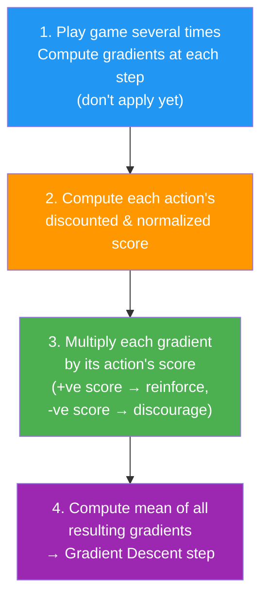

### Key Idea
- Positive action score → apply gradients to make that action **more likely**
- Negative action score → apply **opposite** gradients to make that action **less likely**
- Simply multiply each gradient vector by the corresponding action score

### [Full Policy Gradient Training — CartPole](./policy-gradient-cartpole.py)

Training setup:
```python
y = 1. - tf.to_float(action)  # target: pretend chosen action was best
cross_entropy = tf.nn.sigmoid_cross_entropy_with_logits(labels=y, logits=logits)
optimizer = tf.train.AdamOptimizer(learning_rate)
grads_and_vars = optimizer.compute_gradients(cross_entropy)  # don't apply yet!
gradients = [grad for grad, variable in grads_and_vars]

# Placeholders for tweaked gradients
gradient_placeholders = []
grads_and_vars_feed = []
for grad, variable in grads_and_vars:
    gradient_placeholder = tf.placeholder(tf.float32, shape=grad.get_shape())
    gradient_placeholders.append(gradient_placeholder)
    grads_and_vars_feed.append((gradient_placeholder, variable))
training_op = optimizer.apply_gradients(grads_and_vars_feed)
```

Execution phase:
```python
n_iterations = 250
n_max_steps = 1000
n_games_per_update = 10
discount_rate = 0.95

with tf.Session() as sess:
    init.run()
    for iteration in range(n_iterations):
        all_rewards = []
        all_gradients = []
        for game in range(n_games_per_update):
            current_rewards = []
            current_gradients = []
            obs = env.reset()
            for step in range(n_max_steps):
                action_val, gradients_val = sess.run(
                    [action, gradients],
                    feed_dict={X: obs.reshape(1, n_inputs)})
                obs, reward, done, info = env.step(action_val[0][0])
                current_rewards.append(reward)
                current_gradients.append(gradients_val)
                if done:
                    break
            all_rewards.append(current_rewards)
            all_gradients.append(current_gradients)

        # Multiply gradients by action scores, compute mean
        all_rewards = discount_and_normalize_rewards(all_rewards, discount_rate)
        feed_dict = {}
        for var_index, grad_placeholder in enumerate(gradient_placeholders):
            mean_gradients = np.mean(
                [reward * all_gradients[game_index][step][var_index]
                 for game_index, rewards in enumerate(all_rewards)
                 for step, reward in enumerate(rewards)],
                axis=0)
            feed_dict[grad_placeholder] = mean_gradients
        sess.run(training_op, feed_dict=feed_dict)
```

**Pro tip:** inject prior knowledge to speed up training — add negative rewards for distance from center, penalize large pole angles, or pre-train by imitating a hardcoded policy.

AlphaGo used a similar PG algorithm (plus Monte Carlo Tree Search).

---

## Markov Decision Processes (MDP)

### Markov Chains

A stochastic process with **no memory** — fixed number of states, randomly evolves from one to another.
Transition probability from state $s$ to $s'$ depends only on the pair $(s, s')$, not on past states.

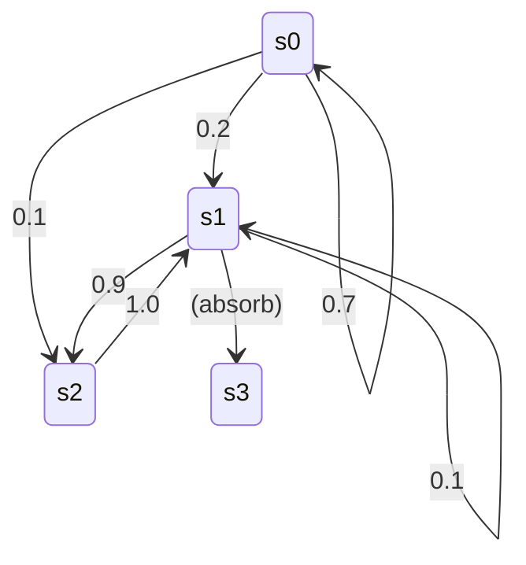

### Markov Decision Process

Like a Markov chain, but with a twist:
- Agent can **choose one of several actions** at each step
- **Transition probabilities depend on the chosen action**
- Some transitions return **rewards** (positive or negative)
- Goal: find a policy that **maximizes rewards over time**

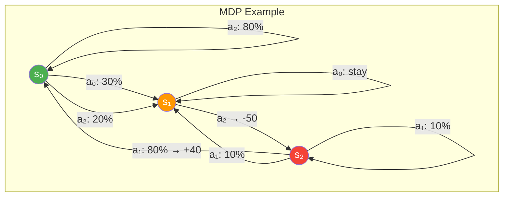

### Bellman Optimality Equation

The optimal state value $V^*(s)$ — sum of all discounted future rewards the agent can expect on average, acting optimally:

$$V^*(s) = \max_a \sum_{s'} T(s,a,s') \left[ R(s,a,s') + \gamma \cdot V^*(s') \right] \quad \forall s$$

Where:
- $T(s,a,s')$ — transition probability from $s$ to $s'$ given action $a$
- $R(s,a,s')$ — reward when going from $s$ to $s'$ given action $a$
- $\gamma$ — discount rate

### Value Iteration Algorithm

Initialize all state values to zero, then iteratively update:

$$V_{k+1}(s) \leftarrow \max_a \sum_{s'} T(s,a,s') \left[ R(s,a,s') + \gamma \cdot V_k(s') \right] \quad \forall s$$

Guaranteed to converge to optimal state values. This is **Dynamic Programming** — breaking infinite-sum problem into tractable sub-problems.

### Q-Values and Q-Value Iteration

The **Q-Value** $Q^*(s,a)$ = expected sum of discounted future rewards after reaching state $s$, choosing action $a$, then acting optimally.

$$Q_{k+1}(s,a) \leftarrow \sum_{s'} T(s,a,s') \left[ R(s,a,s') + \gamma \cdot \max_{a'} Q_k(s',a') \right] \quad \forall s,a$$

**Optimal policy:** $\pi^*(s) = \arg\max_a Q^*(s,a)$

### [Q-Value Iteration — Implementation](./q-value-iteration.py)

```python
import numpy as np

nan = np.nan  # represents impossible actions
T = np.array([  # shape=[s, a, s']
    [[0.7, 0.3, 0.0], [1.0, 0.0, 0.0], [0.8, 0.2, 0.0]],
    [[0.0, 1.0, 0.0], [nan, nan, nan], [0.0, 0.0, 1.0]],
    [[nan, nan, nan], [0.8, 0.1, 0.1], [nan, nan, nan]],
])
R = np.array([  # shape=[s, a, s']
    [[10., 0.0, 0.0], [0.0, 0.0, 0.0], [0.0, 0.0, 0.0]],
    [[10., 0.0, 0.0], [nan, nan, nan], [0.0, 0.0, -50.]],
    [[nan, nan, nan], [40., 0.0, 0.0], [nan, nan, nan]],
])
possible_actions = [[0, 1, 2], [0, 2], [1]]

Q = np.full((3, 3), -np.inf)
for state, actions in enumerate(possible_actions):
    Q[state, actions] = 0.0

discount_rate = 0.95
n_iterations = 100

for iteration in range(n_iterations):
    Q_prev = Q.copy()
    for s in range(3):
        for a in possible_actions[s]:
            Q[s, a] = np.sum([
                T[s, a, sp] * (R[s, a, sp] + discount_rate * np.max(Q_prev[sp]))
                for sp in range(3)
            ])

print(Q)
# array([[ 21.89, 20.80, 16.86],
#        [  1.12,  -inf,  1.18],
#        [  -inf, 53.87,  -inf]])
print(np.argmax(Q, axis=1))  # [0, 2, 1] → optimal policy
# s0→a0, s1→a2 (go through fire!), s2→a1
# With γ=0.9 → s1 becomes a0 (stay put) — future less valued
```

---

## Temporal Difference Learning & Q-Learning

The agent initially doesn't know transition probabilities $T$ or rewards $R$ — must learn from experience.

### TD Learning Algorithm

$$V_{k+1}(s) \leftarrow (1 - \alpha) \cdot V_k(s) + \alpha \left( r + \gamma \cdot V_k(s') \right)$$

Where $\alpha$ is the learning rate. Similar to SGD — handles one sample at a time, converges if $\alpha$ is gradually reduced.

### Q-Learning Algorithm

Adaptation of Q-Value Iteration for unknown $T$ and $R$:

$$Q_{k+1}(s,a) \leftarrow (1 - \alpha) \cdot Q_k(s,a) + \alpha \left( r + \gamma \cdot \max_{a'} Q_k(s',a') \right)$$

This is an **off-policy** algorithm — the policy being trained is not the one being executed (learns optimal policy by watching random actions).

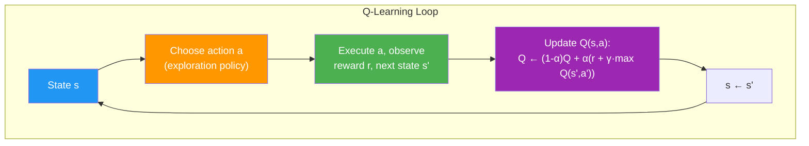

### [Q-Learning Implementation](./q-learning.py)

```python
import numpy as np
import numpy.random as rnd

learning_rate0 = 0.05
learning_rate_decay = 0.1
n_iterations = 20000
discount_rate = 0.95
s = 0

Q = np.full((3, 3), -np.inf)
for state, actions in enumerate(possible_actions):
    Q[state, actions] = 0.0

for iteration in range(n_iterations):
    a = rnd.choice(possible_actions[s])
    sp = rnd.choice(range(3), p=T[s, a])
    reward = R[s, a, sp]
    learning_rate = learning_rate0 / (1 + iteration * learning_rate_decay)
    Q[s, a] = learning_rate * Q[s, a] + (1 - learning_rate) * (
        reward + discount_rate * np.max(Q[sp])
    )
    s = sp
```

### Exploration Policies

1. **ε-greedy:** act randomly with probability $\varepsilon$, greedily with $1 - \varepsilon$
   - Common: start $\varepsilon = 1.0$, gradually reduce to $0.05$
   - Balances exploration of unknown regions with exploitation of known good actions

2. **Exploration function bonus:** add bonus to Q-Value estimates:
   $$Q(s,a) \leftarrow (1-\alpha)Q(s,a) + \alpha\left(r + \gamma \cdot \max_{a'} f(Q(s',a'), N(s',a'))\right)$$
   Where $f(q,n) = q + K/(1+n)$ and $N(s',a')$ counts how often action $a'$ was chosen in state $s'$.
   $K$ = curiosity hyperparameter.

---

## Approximate Q-Learning & Deep Q-Networks (DQN)

Q-Learning doesn't scale — Ms. Pac-Man has $2^{250} \approx 10^{75}$ possible states (just for pellets).
**Solution:** use a function (neural network) to **approximate** Q-Values → **Deep Q-Network (DQN)**.

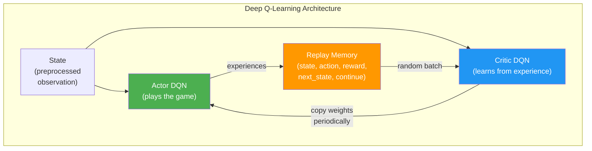

Key DQN innovations:
- **Two networks:** Actor (plays) & Critic (learns) — critic copied to actor at regular intervals
- **Replay memory:** stores experiences as 5-tuples, samples random batches → breaks correlation between consecutive experiences
- **ε-greedy exploration:** gradually decrease ε from 1.0 to 0.05

### DQN Cost Function

$$J(\theta_{\text{critic}}) = \frac{1}{m} \sum_{i=1}^{m} \left( y^{(i)} - Q(s^{(i)}, a^{(i)}, \theta_{\text{critic}}) \right)^2$$

with $y^{(i)} = r^{(i)} + \gamma \cdot \max_{a'} Q(s'^{(i)}, a', \theta_{\text{actor}})$

- Actor estimates future Q-Values (target)
- Critic is trained to predict those Q-Values (MSE loss)

### [Deep Q-Learning — Ms. Pac-Man](./dqn-pacman.py)

**Preprocessing:** crop, downsize to 88×80, grayscale, normalize to [-1, 1]

```python
mspacman_color = np.array([210, 164, 74]).mean()

def preprocess_observation(obs):
    img = obs[1:176:2, ::2]        # crop and downsize
    img = img.mean(axis=2)          # to greyscale
    img[img == mspacman_color] = 0  # improve contrast
    img = (img - 128) / 128 - 1    # normalize from -1 to 1
    return img.reshape(88, 80, 1)
```

**DQN Architecture (3 conv layers + 2 FC layers):**

| Layer | Type | Maps/Units | Kernel | Stride | Padding | Activation |
|-------|------|-----------|--------|--------|---------|------------|
| Input | — | 1 | — | — | — | — |
| Conv1 | Convolution | 32 | 8×8 | 4 | SAME | ReLU |
| Conv2 | Convolution | 64 | 4×4 | 2 | SAME | ReLU |
| Conv3 | Convolution | 64 | 3×3 | 1 | SAME | ReLU |
| FC1 | Fully Connected | 512 | — | — | — | ReLU |
| Output | Fully Connected | 9 | — | — | — | None |

**Training flow:**

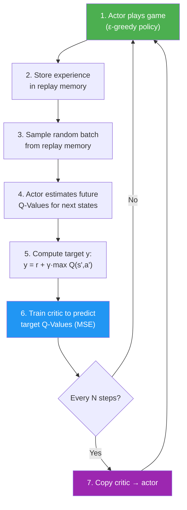

**Key hyperparameters:**
- `replay_memory_size = 10000`
- `eps_min = 0.05`, `eps_max = 1.0`, `eps_decay_steps = 50000`
- `training_start = 1000` (warmup before training)
- `training_interval = 3` (train every 3 game steps)
- `copy_steps = 25` (copy critic → actor every 25 training steps)
- `batch_size = 50`, `discount_rate = 0.95`

---

## Summary

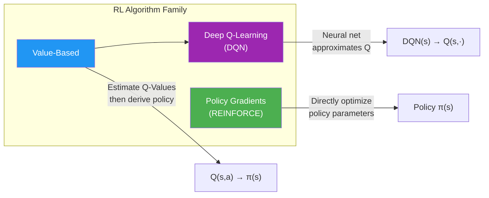

| Concept | Key Idea |
|---------|----------|
| RL | Agent learns by trial & error to maximize rewards |
| Policy | Algorithm that determines agent's actions |
| Credit Assignment | Which actions to credit/blame for delayed rewards? → discounted rewards |
| REINFORCE | Compute gradients → multiply by action scores → gradient descent |
| MDP | States + actions + transition probs + rewards; Bellman equation |
| Q-Learning | Learn Q-Values from experience without knowing T or R |
| DQN | Neural net approximates Q-Values; actor–critic + replay memory |
| Exploration | ε-greedy or curiosity bonuses to balance explore vs exploit |