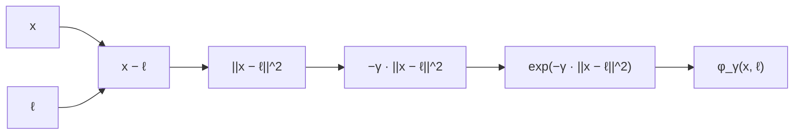
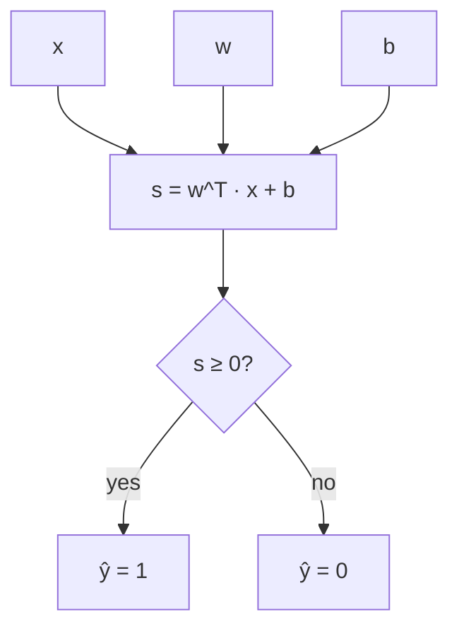
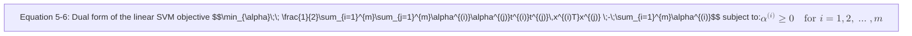

# [Support Vector Machine](./svm.py)

Machine Learning Model that is capable of performing linear or nonlinear classification, regression, and even
outlier detection

## Linear SVM Classification
u can classify data with a straight line(linearly sperable)
dashed lines show bad model so that can't even separate classes properly

but it also tries to stay away from the training data

adding more training instances “off the street” will not affect the decision
boundary at all: it is fully determined (or “supported”) by the instances located on the edge of the street.

called `support vectors`

## Soft Margin Classification

hard margin classification: strictly impose that all instances be off the street and on the right side
2 issues: works only if data is linearly separable, sensitive to outliers

soft margin classification: more flexible model.find a good balance between keeping the street as large as possible and limiting the margin violations

control this balance by using C hyperparameter: a smaller C value leads to a wider street but more margin violations

```python
import numpy as np
from sklearn import datasets
from sklearn.pipeline import Pipeline
from sklearn.preprocessing import StandardScaler
from sklearn.svm import LinearSVC
iris = datasets.load_iris()
X = iris["data"][:, (2, 3)] # petal length, petal width
y = (iris["target"] == 2).astype(np.float64) # Iris-Virginica

svm_clf = Pipeline((
    ("scaler", StandardScaler()),
    ("linear_svc", LinearSVC(C=1, loss="hinge")),
))

svm_clf.fit(X_scaled, y)
svm_clf.predict([[5.5, 1.7]])
```

they do not output probabilities.

## Non Linear SVM Classification

many datasets are not even close to being linearly separable. One approach to
handling nonlinear datasets is to add more features, such as polynomial features 

we use a polynomial regression

```python
from sklearn.datasets import make_moons
from sklearn.pipeline import Pipeline
from sklearn.preprocessing import PolynomialFeatures
polynomial_svm_clf = Pipeline((
    ("poly_features", PolynomialFeatures(degree=3)),
    ("scaler", StandardScaler()),
    ("svm_clf", LinearSVC(C=10, loss="hinge"))
))
polynomial_svm_clf.fit(X, y)
```

## Polynomial Kernel

low polynomial degree: can't deal with complex data
high polynomial degree: large no of features, model becomes slow

apply kernel trick to get results similar to high polynomial degree without actually adding them.

```python
from sklearn.svm import SVC
poly_kernel_svm_clf = Pipeline((
("scaler", StandardScaler()),
("svm_clf", SVC(kernel="poly", degree=3, coef0=1, C=5))
))
poly_kernel_svm_clf.fit(X, y)
```
This code trains an SVM classifier

## Adding Similarity Features
add features computed using a similarity function that measures how much each instance resembles a particular landmark

similarity function: Gaussian Radial Basis Function (RBF) with γ = 0.3


## Gaussian RBF Kernel

expensive to use similarity features method
possible to obtain a similar result as if you had added many similarity features, without actually having to add them.

```python
rbf_kernel_svm_clf = Pipeline((
("scaler", StandardScaler()),
("svm_clf", SVC(kernel="rbf", gamma=5, C=0.001))
))
rbf_kernel_svm_clf.fit(X, y)
```

## Computational Complexity
The LinearSVC class is based on the liblinear library, which implements an optimized
algorithm for linear SVMs.1 It does not support the kernel trick, but it scales almost linearly with the number of training instances and the number of features: its training
time complexity is roughly O(m × n).

controlled by
the tolerance hyperparameter ϵ (called tol in Scikit-Learn). In most classification tasks, the default tolerance is fine.
Time complexity: b/w `O(m2*n)` and `O(m3*n)`.
Add features computed using a similarity function that measures how much each instance resembles a particular landmark (a "prototype" or "landmark" \(\ell\)). A common similarity is the Gaussian radial basis function (RBF):

$$
\phi_{\gamma}(\mathbf{x},\ell) = \exp\bigl(-\gamma\,\|\mathbf{x}-\ell\|^2\bigr).
$$

Use many landmarks (or the kernel trick) to turn each instance into a vector of similarity features.

## SVM Regression
supports linear-nonlinear classification as well as regression

trick is to reverse the objective: instead of trying to fit the largest possible street between two classes while limiting margin violations, SVM Regression
tries to fit as many instances as possible on the street while limiting margin violations (i.e., instances off the street).

Adding more training instances within the margin does not affect the model’s predic‐
tions; thus, the model is said to be ϵ -insensitive.

```python
from sklearn.svm import LinearSVR
svm_reg = LinearSVR(epsilon=1.5)
svm_reg.fit(X, y)
```


SVR class (which supports the kernel trick). The SVR class is the regression equivalent of the SVC class, and the LinearSVR class is the regression equivalent of the LinearSVC class
```python
from sklearn.svm import SVR
svm_poly_reg = SVR(kernel="poly", degree=2, C=100, epsilon=0.1)
svm_poly_reg.fit(X, y)
```

decision function:
```
wT· x + b = w1 x1 + ⋯ + wn xn + b
```


## Training Objective
slope of the decision function= norm of the weight vector, || w ||

dividing the slope by 2 will multiply the margin by 2
The smaller the weight vector w, the larger the margin.


minimise ||w|| to get large margin

Define t^{(i)} = -1 for negative instances (if y^{(i)} = 0) and t^{(i)} = +1 for positive instances (if y^{(i)} = 1). The hard-margin linear SVM objective is

$$
\min_{\mathbf{w},b}\; \tfrac{1}{2}\,\mathbf{w}^\top \mathbf{w}
$$

subject to

$$
t^{(i)}\bigl(\mathbf{w}^\top \mathbf{x}^{(i)} + b\bigr) \ge 1,\qquad i=1,\dots,m.
$$


## Quadratic Programming

The general form of a quadratic programming (QP) problem is

$$
\min_{\mathbf{p}}; \tfrac{1}{2},\mathbf{p}^\top \mathbf{H}\\,\mathbf{p} + \mathbf{f}^\top \mathbf{p}
$$

subject to

$$
\mathbf{A}\\,\mathbf{p} \le \mathbf{b}.
$$

Here:

- $\mathbf{p}$ is an $n_p$-dimensional vector ($n_p$ = number of parameters),
- $\mathbf{H}$ is an $n_p\\times n_p$ matrix,
- $\mathbf{f}$ is an $n_p$-dimensional vector,
- $\mathbf{A}$ is an $n_c\\times n_p$ matrix ($n_c$ = number of constraints),
- $\mathbf{b}$ is an $n_c$-dimensional vector.

You can obtain the hard-margin linear SVM objective by setting the QP parameters as follows:

- $n_p = n + 1$, where $n$ is the number of features (the $+1$ is for the bias term),
- $n_c = m$, where $m$ is the number of training instances,
- $\\mathbf{H}$ = $\\mathbf{I}_{n_p}$ (the $n_p\\times n_p$ identity), except with a zero in the top-left cell (to ignore the bias term),
- $\\mathbf{f} = \\mathbf{0}$ (an $n_p$-dimensional zero vector),
- $\\mathbf{b} = \\mathbf{1}$ (an $n_c$-dimensional vector of ones),
- each constraint row $\\mathbf{a}^{(i)} = -t^{(i)}\\,\\bar{\\mathbf{x}}^{(i)}$, where $\\bar{\\mathbf{x}}^{(i)}$ is equal to $\\mathbf{x}^{(i)}$ with an extra bias feature $\\bar{x}_0 = 1$.


## Dual Problem




  $$\hat{w} = \sum_{i=1}^{m}\hat{\alpha}^{(i)}t^{(i)}x^{(i)}$$

  $$\hat{b} = \frac{1}{n_s}\sum_{i=1}^{m}\Big(1 - t^{(i)}(\hat{w}^T x^{(i)})\Big)$$

Only support vectors (indices with $\hat{\alpha}^{(i)}>0$) contribute to these sums.


## Kernelized SVM

* **Idea:** If data isn’t linearly separable in the original space, map it to a higher-dimensional space using a feature transform **ϕ(x)**, then run a linear SVM there.

**Example (2nd-degree polynomial mapping):**
  A 2D input gets mapped to 3D:
  
$$
\phi\begin{pmatrix} x_1 \\ x_2 \end{pmatrix} = \begin{bmatrix} x_1^2 \\ \sqrt{2}\,x_1 x_2 \\ x_2^2 \end{bmatrix}.
$$

* **Kernel trick:**
  Instead of explicitly computing $\phi(\mathbf{x})$, we can use the identity (for this mapping):

$$
\phi(\mathbf{a})^\top\phi(\mathbf{b}) = (\mathbf{a}^\top\mathbf{b})^2.
$$
  So the dot product in the transformed space can be computed directly from the original vectors.

* **Kernel function:**
  A kernel $K(\mathbf{a},\mathbf{b})$ is defined as

$$
K(\mathbf{a},\mathbf{b}) = \phi(\mathbf{a})^\top\phi(\mathbf{b}).
$$

  Common kernels:

  - Linear: $K(\mathbf{a},\mathbf{b})=\mathbf{a}^\top\mathbf{b}$
  - Polynomial: $K(\mathbf{a},\mathbf{b})=(\gamma\,\mathbf{a}^\top\mathbf{b} + r)^d$
  - Gaussian RBF: $K(\mathbf{a},\mathbf{b})=\exp\big(-\gamma\,\|\mathbf{a}-\mathbf{b}\|^2\big)$
  - Sigmoid: $K(\mathbf{a},\mathbf{b})=\tanh(\gamma\,\mathbf{a}^\top\mathbf{b} + r)$

* **Mercer’s Theorem:**
  If a kernel satisfies Mercer’s conditions, then some valid feature mapping ϕ exists (even if we don’t know it). For RBF, the mapped space can be **infinite-dimensional**.

* **Prediction with Kernelized SVM:**
  The classifier becomes:

$$
h(\mathbf{x}^{(n)}) = \sum_{i=1}^m \hat{\alpha}^{(i)} t^{(i)} K\big(\mathbf{x}^{(i)},\mathbf{x}^{(n)}\big) + \hat{b}.
$$

  Only support vectors (indices with $\hat{\alpha}^{(i)}\neq 0$) contribute.

* **Bias term computation:**
  Bias is computed using the same kernel substitution, avoiding explicit ϕ(x) completely.


## Online SVM

use Gradient Descent (e.g., using `SGDClassifier`) to minimize the cost function.

Equation 5-13: Linear SVM classifier cost (hinge loss + regularization):

$$
J(\mathbf{w},b) = \frac{1}{2}\,\mathbf{w}^\top\mathbf{w} + C\sum_{i=1}^m \max\big(0,\;1 - t^{(i)}(\mathbf{w}^\top\mathbf{x}^{(i)} + b)\big).
$$