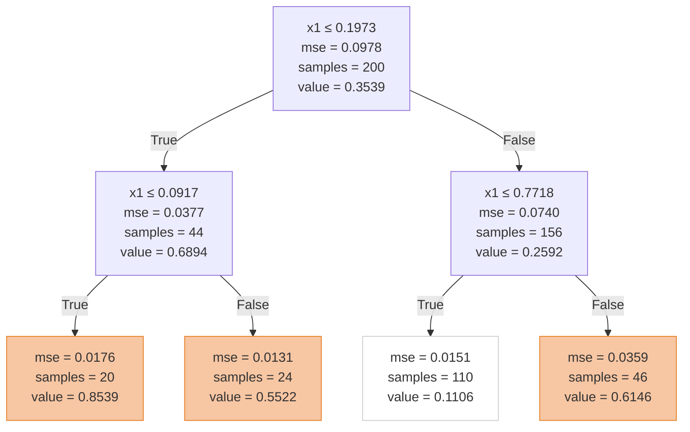
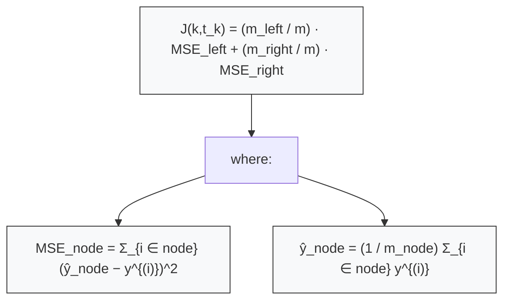

# Decision Tree
can perform both classification and regression tasks,

## Training and Visualizing a Decision Tree
trains a DecisionTreeClassifier on the iris dataset
```python
from sklearn.datasets import load_iris
from sklearn.tree import DecisionTreeClassifier
iris = load_iris()
X = iris.data[:, 2:] # petal length and width
y = iris.target
tree_clf = DecisionTreeClassifier(max_depth=2)
tree_clf.fit(X, y)
```

visualise this trained decision tree
```python
from sklearn.tree import export_graphviz
export_graphviz(
tree_clf,
out_file=image_path("iris_tree.dot"),
feature_names=iris.feature_names[2:],
class_names=iris.target_names,
rounded=True,
filled=True
)
```

convert the dot file to png: `dot -Tpng iris_tree.dot -o iris_tree.png`

## Making Predictions
you start with a base case, then you check for particular features at every node, and make a decision
like root node: flower’s petal length is smaller than 2.45 cm
if yes then move to left node, else to right
leaf node represents predicted class

a node’s gini attribute measures its impurity: a node is “pure” (gini=0) if all training instances it applies to belong to the same class.

$$
G_i = 1 - \sum_{k=1}^n p_{i,k}^2
$$

- $p_{i,k}$ is the ratio of class $k$ instances among the training instances in the $i$-th node.


## Estimating Class Probabilities
decision tree can also show possibility if an instance belongs to a class or not
- traverses the tree to find the leaf node for this instance,
- returns the ratio of training instances of class k in this node

flower whose petals are 5 cm long and 1.5 cm wide
0% for Iris-Setosa (0/54), 90.7% for Iris-Versicolor (49/54), and 9.3% for Iris-Virginica (5/54)
```python
>>> tree_clf.predict_proba([[5, 1.5]])
array([[ 0. , 0.90740741, 0.09259259]])
>>> tree_clf.predict([[5, 1.5]])
array([1])
```

## CART(Classification And Regression Tre) Algorithm

Equation 6-2. CART cost function for classification

The CART split cost for splitting a node using feature $k$ and threshold $t_k$ is the weighted impurity of the two child subsets:

$$
J(k,t_k) = \frac{m_{\text{left}}}{m}\,G_{\text{left}} + \frac{m_{\text{right}}}{m}\,G_{\text{right}}
$$

where $G_{\text{left}}$ and $G_{\text{right}}$ measure the impurity (e.g. Gini) of the left and right subsets, and $m_{\text{left}}$, $m_{\text{right}}$ are the numbers of instances in the left/right subset (with $m = m_{\text{left}}+m_{\text{right}}$).

Choose the split $(k,t_k)$ that minimizes $J(k,t_k)$.

used to train decision tree
the algorithm first splits the training set in two subsets using a single feature k and a threshold tk (e.g., “petal length ≤ 2.45 cm”). 

searches for the pair (k, tk) that produces the purest subsets (weighted by their size)


splits data into 2, then them into further 2 and so on, stops when reaches max depth or can't find split

few stopping condition: (min_samples_split, min_samples_leaf, min_weight_fraction_leaf, and max_leaf_nodes)

**Problem**: finding the optimal tree is known to be an NP-Complete problem, it
requires O(exp(m)) time, making the problem intractable even for fairly small training sets.

## Computational Complexity
traversing the Decision Tree requires going through roughly O(log2(m)) nodes
overall prediction complexity is just O(log2(m))

training algorithm compares all features (or less if max_features is set)
on all samples at each node; complexity: O(n × m log(m))

## Gini Impurity or Entropy
by default we use Impurity, but can use entropy

entropy approaches zero when molecules are still and well ordered
entropy is zero when all messages are identical

ml: a set’s entropy is zero when it contains instances of only one class
It is defined as:

$$
H_i = -\sum_{k=1}^n p_{i,k} \log\bigl(p_{i,k}\bigr)
$$

- the sum is taken only over classes with $p_{i,k}>0$ to avoid the undefined $\log(0)$ term.

Gini Impurity leads to similar trees

## Regularization Hyperparameter
- Restrict maximum depth: set `max_depth` to prevent overly deep trees and overfitting.
- Increase `min_samples_split` so a node must have more samples before it can be split.
- Increase `min_samples_leaf` to avoid leaves with very few training instances.
- Limit complexity with `max_leaf_nodes` or reduce `max_features` evaluated at each split.
- Use `min_weight_fraction_leaf` or sample weighting to enforce minimum leaf weights.

## Regression
```python
from sklearn.tree import DecisionTreeRegressor
tree_reg = DecisionTreeRegressor(max_depth=2)
tree_reg.fit(X, y)
```



looks similar to classification tree, only difference is that instead of predicting a class in each node, it predicts a value.

CART algorithm works mostly the same way as earlier, except that instead of trying to split the training set in a way that minimizes impurity, it now tries to split the
training set in a way that minimizes the MSE



# Instability

Summary — Decision Tree strengths and limitations (5 points)
- Strengths: simple, interpretable, versatile, and powerful for classification and regression.
- Axis-aligned splits: trees use orthogonal decision boundaries, so they’re sensitive to rotations of the training set.
- Rotation example: a 45° rotation can make an otherwise simple boundary look convoluted and harm generalization.
- Instability: small changes in training data (or training randomness) can produce very different trees unless `random_state` is fixed.
- Fixes: apply PCA for better orientation or use ensemble methods (e.g., Random Forests) to reduce instability and improve generalization.