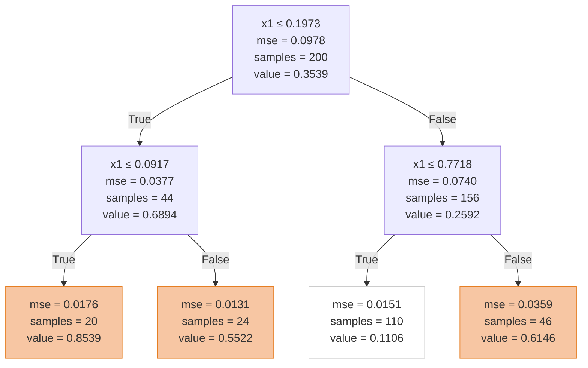
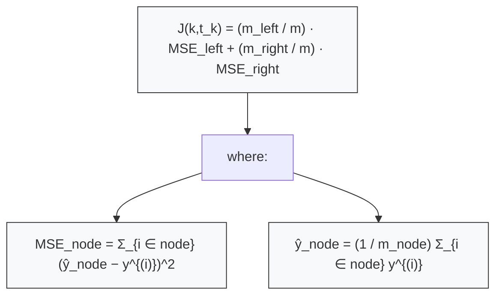

# [Decision Trees: Quinlan (1986)](https://hunch.net/~coms-4771/quinlan.pdf)

One question began this:
how can a machine learn a rule that maps observed features to outcomes?
Do knowledge based experts based on thousands of rules. But it's not really practical and feasible.

It can perform both classification and regression tasks.

# Core Idea

A Decision Tree is a recursive partitioning structure that assigns objects to classes based on attribute values.

> Each internal node tests an attribute  
> Each branch represents a possible outcome  
> Each leaf specifies a class

**TDIDT(Top-Down Induction of Decision Trees) approach**
basically systems is presented with a complete training set and it develops the tree from root to leaves, guided by frequency information but not by presentation order.

objects are collection of attributes, where values are from a discrete set. Ex:

Saturday mornings might be characterized by:

- `outlook`: {sunny, overcast, rain}
- `temperature`: {cool, mild, hot}
- `humidity`: {high, normal}
- `windy`: {true, false}

Ex:create a classification rule from a set of objects with known classes. Attributes need to be adequate.

Consider a training set of 14 Saturday mornings classified as suitable (Y) or unsuitable (N) for some activity. A decision tree testing `outlook` first, then `humidity` and `windy` as needed, captures the classification structure:

```
outlook
├─ sunny → humidity
│           ├─ high → N
│           └─ normal → Y
├─ overcast → Y
└─ rain → windy
            ├─ true → N
            └─ false → Y
```

# Maths

### Entropy

Let $C$ be a collection of objects containing $p$ instances of class $P$ and $n$ instances of class $N$. The information required to specify the class of an arbitrary object from $C$ is:

$$
I(p, n) = -\frac{p}{p+n} \log_2 \frac{p}{p+n} - \frac{n}{p+n} \log_2 \frac{n}{p+n}
$$

This measure derives from Shannon's information theory. It quantifies the expected information content of the message identifying an object's class, assuming classes appear in proportion to their frequency in $C$.

Properties:

- $I(p, n) = 0$ when all objects belong to one class (no uncertainty)
- $I(p, n)$ is maximal when $p = n$ (maximum uncertainty)

### Information Gain

Consider attribute $A$ with values $\{A_1, A_2, \ldots, A_v\}$. Branching on $A$ partitions $C$ into subsets $\{C_1, C_2, \ldots, C_v\}$ where $C_i$ contains objects with value $A_i$. Let $C_i$ contain $p_i$ objects of class $P$ and $n_i$ objects of class $N$.

The expected information requirement after testing $A$ is:

$$
E(A) = \sum_{i=1}^{v} \frac{p_i + n_i}{p + n} I(p_i, n_i)
$$

This weighted average reflects the residual uncertainty across branches. The **information gain** from branching on $A$ is:

$$
\text{gain}(A) = I(p, n) - E(A)
$$

Interpretation: the reduction in expected information requirement achieved by testing attribute $A$. Equivalently, $E(A)$ is the mutual information between attribute $A$ and class.

**Example computation:** For the 14-object training set with 9 positive and 5 negative instances:

$$
I(9, 5) = -\frac{9}{14} \log_2 \frac{9}{14} - \frac{5}{14} \log_2 \frac{5}{14} = 0.940 \text{ bits}
$$

For `outlook` with partitions (2P, 3N), (4P, 0N), (3P, 2N):

$$
E(\text{outlook}) = \frac{5}{14} I(2,3) + \frac{4}{14} I(4,0) + \frac{5}{14} I(3,2) = 0.694 \text{ bits}
$$

$$
\text{gain}(\text{outlook}) = 0.940 - 0.694 = 0.246 \text{ bits}
$$

Similarly: gain(temperature) = 0.029, gain(humidity) = 0.151, gain(windy) = 0.048.

The attribute maximizing gain (`outlook`) is selected for the root.

Measured in bits (logarithm base 2)

---

# [ID3 Algorithm](./decision_tree.py)

## Structure

ID3 operates through an iterative outer loop:

1. Select a random subset of the training set (the **window**)
2. Construct a decision tree that correctly classifies all window objects
3. Test the tree on all remaining training objects
4. If all are correctly classified, terminate
5. Otherwise, add misclassified objects to the window and repeat

This windowing approach often finds correct trees faster than processing the entire training set directly. Empirical evidence shows convergence within few iterations for training sets of 30,000 objects and 50 attributes. However, O'Keefe (1983) noted that convergence cannot be guaranteed unless the window can grow to encompass the entire training set — a limitation not yet observed in practice.

## Tree Construction

Given collection $C$:

**Base cases:**

- If $C$ is empty or contains only one class: create a leaf labeled with that class
- If all attributes exhausted: create a leaf labeled with the majority class in $C$

**Recursive case:**

1. Evaluate $\text{gain}(A)$ for each untested attribute $A$
2. Select $A^* = \arg\max_A \text{gain}(A)$
3. Create node testing $A^*$ with branches for each value $\{A_1, \ldots, A_v\}$
4. Partition $C$ into $\{C_1, \ldots, C_v\}$ by attribute values
5. Recursively construct subtrees for each non-empty $C_i$

**Special case:** If partition $C_j$ is empty (no training objects have value $A_j$), ID3 originally labeled the leaf "null." A superior approach assigns the majority class from the parent collection $C$.

## Computational Complexity

At each non-leaf node, computing gain for attribute $A$ requires examining every object in $C$ to determine its class and value of $A$. The complexity per node is $O(|C| \cdot |A|)$ where $|A|$ is the number of attributes.

Total complexity per iteration: $O(|C| \cdot |A| \cdot |N|)$ where $|N|$ is the number of non-leaf nodes. This relationship extends across iterations. Critically, no exponential growth in time or space has been observed as task dimensions increase, enabling application to large-scale problems.

## Empirical Performance

**Chess endgame domain (715 distinct positions, 49 binary attributes):**

- Training on 20% random sample → 84% accuracy on unseen objects
- Correct tree contains ≈150 nodes (complex domain)

**Simplified domain (1,987 objects, 48-node correct tree):**

- Training on 20% random sample → 98% accuracy on unseen objects

These results demonstrate that induced trees capture genuine relationships rather than memorizing random patterns. The preference for simpler trees follows Occam's Razor and is supported by theoretical analysis: Pearl (1978) and Quinlan (1983) derived upper bounds on expected error showing that bounds increase with generalization complexity for fixed training set size.

---

# Handling Noise

Real-world data suffers from systematic and non-systematic errors. Measurement instruments produce false readings, subjective assessments vary between observers, and training sets include misclassified objects. Such **noise** creates two problems:

1. Attributes may appear inadequate when objects with identical descriptions have different classes
2. Trees may develop spurious complexity attempting to explain noise-generated exceptions

**Example:** In the 14-object training set, corrupting `outlook` of object 1 from "sunny" to "overcast" creates conflict with object 3 (identical descriptions, different classes). Corrupting the class of object 3 from P to N forces the tree to grow from 8 to 12 nodes to accommodate the apparent special case.

## Chi-Square Test for Attribute Relevance

An attribute $A$ with random values still produces apparent information gain unless class proportions are identical across all partitions. To distinguish genuinely relevant attributes from noise:

Let $A$ partition $C$ (containing $p$ positive, $n$ negative instances) into subsets with $(p_i, n_i)$ objects. If $A$ is independent of class, the expected values are:

$$
p'_i = p \cdot \frac{p_i + n_i}{p + n}, \quad n'_i = n \cdot \frac{p_i + n_i}{p + n}
$$

The statistic:

$$
\chi^2 = \sum_{i=1}^{v} \frac{(p_i - p'_i)^2}{p'_i} + \frac{(n_i - n'_i)^2}{n'_i}
$$

follows a chi-square distribution with $v-1$ degrees of freedom (provided expected values are not too small). This tests the null hypothesis that $A$ is independent of class.

**Implementation:** Prevent testing any attribute whose irrelevance cannot be rejected at high confidence (e.g., 99% level). This screening effectively prevents overfitting to noise without degrading performance in noise-free cases. Threshold-based approaches (requiring gain to exceed some value) failed: thresholds large enough to filter irrelevant attributes also excluded relevant ones.

## Classification with Inadequate Attributes

When a collection $C$ contains both classes but no relevant attributes remain:

**Approach 1 (probabilistic):** Assign class value $p/(p+n) \in (0,1)$, minimizing sum of squared errors.

**Approach 2 (majority voting):** Assign the more numerous class (P if $p > n$, N if $p < n$), minimizing sum of absolute errors.

For minimizing expected error rate, majority voting proves superior empirically.

## Noise Experiments

Study on 551-object, 39-attribute chess domain. Noise level $m$% means each value has $m$% probability of replacement by a random value from the attribute's range.

**Results (averaged over 20 runs):**

| Noise Level | Single Attribute | All Attributes | Class Info |
| ----------- | ---------------- | -------------- | ---------- |
| 5%          | 1.3%             | 11.9%          | 2.6%       |
| 10%         | 2.5%             | 18.9%          | 5.5%       |
| 20%         | 4.6%             | 27.8%          | 9.9%       |
| 50%         | 8.8%             | 29.2%          | 21.8%      |
| 100%        | 10.8%            | 25.9%          | 49.6%      |

**Observations:**

- Class noise produces linear degradation (50% noise → 50% error)
- Single-attribute noise has modest impact
- All-attribute noise creates a peak around 50% then declines

**Peak explanation:** At moderate noise (~50%), the algorithm still finds apparently relevant attributes but the tree performs randomly on equally noisy test data. Expected error for tree classifying as P with probability $p/(p+n)$:

$$
E_{\text{tree}} = p \cdot \left(1 - \frac{p}{p+n}\right) + n \cdot \frac{p}{p+n} = \frac{2pn}{(p+n)}
$$

At very high noise, all attributes fail chi-square tests. The tree assigns everything to majority class (assume P), giving expected error:

$$
E_{\text{majority}} = \frac{n}{p+n} < \frac{2pn}{(p+n)}
$$

The decline reflects the protective effect of the relevance test.

**Counterintuitive finding:** Trees trained on noisy data sometimes outperform correct trees when classifying similarly noisy test objects. The noise in training helps the tree adapt to noise in deployment — eliminating training noise can be counterproductive if field data remains noisy.

---

# Unknown Attribute Values

Incomplete training data (missing attribute values) requires modifications distinct from noise handling.

## Attempted Solutions

**Bayesian estimation:** For object in class P with unknown value of $A$, estimate probability of value $A_i$:

$$
P(A = A_i \mid \text{class} = P) = \frac{P(A = A_i \land \text{class} = P)}{P(\text{class} = P)} = \frac{p_i}{p}
$$

where $p_i$ counts objects with value $A_i$ and class P among those with known $A$ values.

**Decision-tree inference:** Form a tree where $A$ becomes the target "class" and the original class becomes an attribute. Use this tree to predict missing values.

**Most common value:** Always replace unknowns with the mode of $A$.

**Empirical comparison (551-object task, single unknown value):**

| Method            | Attr 1 | Attr 2 | Attr 3 |
| ----------------- | ------ | ------ | ------ |
| Bayesian          | 28%    | 27%    | 38%    |
| Decision tree     | 19%    | 22%    | 19%    |
| Most common value | 28%    | 27%    | 40%    |

Error rates (proportion of incorrect replacements) remain disappointingly high. The decision-tree method uses more context and performs better, but none are reliable.

**Treating "unknown" as a value:** Letting "unknown" be an additional attribute value creates anomalies. An attribute with many unknowns may appear to have higher information gain, contrary to intuition.

## Successful Strategy

**During tree construction:**

For attribute $A$ with values $\{A_1, \ldots, A_v\}$ and collection $C$ containing $p_u$ positive and $n_u$ negative instances with unknown $A$ values:

Distribute unknowns proportionally when computing gain:

$$
\text{effective}\ p_i = p_i + p_u \cdot \frac{p_i + n_i}{\sum_j (p_j + n_j)}
$$

Similarly for $n_i$. This ensures unknowns can only decrease information gain.

When an attribute is selected, **discard** objects with unknown values of that attribute before recursing.

**During classification:**

When classifying an object with unknown value of attribute $A$ at a node testing $A$:

1. Begin with token value $T = 1.0$
2. Explore all branches, distributing the token:

$$
T_i = T \cdot \frac{p_i + n_i}{\sum_j (p_j + n_j)}
$$

3. Continue recursively, further distributing tokens at subsequent unknowns
4. Accumulate token values at leaves for each class
5. Assign the class with higher total token value

This **probabilistic branching** provides graceful degradation.

## Performance Under Ignorance

Experiment: 551 objects, 39 attributes. Each value replaced by "unknown" with probability $m$% (ignorance level).

**Results:** At 10% ignorance (one in ten values missing), accuracy remains near 90%. At 50% ignorance, accuracy exceeds 60%. Degradation is gradual and continuous, without catastrophic failure.

Performance is substantially better when a correct tree classifies objects with unknowns, compared to an incomplete-data-trained tree classifying incomplete data.

**Extension:** Catlett (1985) generalized this approach using Shafer notation to represent partial knowledge — probabilistic assertions about subsets of possible values rather than complete ignorance.

---

# The Selection Criterion

## Bias Toward Many-Valued Attributes

The gain criterion exhibits systematic bias favoring attributes with many values.

**Analysis:** Let $A'$ be formed from $A$ by splitting one value into two. It can be proven:

$$
\text{gain}(A') \geq \text{gain}(A)
$$

with equality only when class proportions are identical in both subdivisions. Generally $\text{gain}(A') > \text{gain}(A)$, so the criterion prefers finer-grained attributes.

**Pathological case:** An attribute with random values but enough distinct values that no two training objects share the same value achieves maximum information gain. The criterion would select this attribute despite it containing zero information relevant to classification.

Bratko's group encountered medical tasks where "age of patient" (nine ranges) was selected over attributes judged more relevant by specialists, highlighting this bias in practice.

## Subset Criterion (ASSISTANT)

Restrict all tests to binary outcomes. For attribute $A$ with values $\{A_1, \ldots, A_v\}$:

Instead of $v$-way branching, choose a subset $S \subseteq \{A_1, \ldots, A_v\}$ and create two branches:

- One for values in $S$
- One for values not in $S$

Compute gain as if all values in $S$ were amalgamated into one value and remaining values into another. The test selected maximizes gain over all attributes and all non-trivial subsets.

**Advantages:**

- Eliminates bias toward many-valued attributes
- Produces smaller trees with improved classification performance

**Disadvantages:**

- Reduced intelligibility (unrelated values grouped together, multiple tests on same attribute)
- Computational cost: For $v$ values, there are $2^{v-1} - 1$ non-trivial subsets to evaluate (removing symmetric and trivial cases). For $v = 20$, this becomes infeasible.

**Note:** This returns to CLS's binary format but generalizes from single values to value sets. Continuous attributes naturally fit this framework: for sorted distinct values $\{V_1, \ldots, V_k\}$, each threshold $(V_i + V_{i+1})/2$ suggests a binary partition to evaluate.

## Gain Ratio Criterion

Alternative approach addressing bias without computational explosion:

The information content of learning an attribute's value is:

$$
IV(A) = -\sum_{i=1}^{v} \frac{p_i + n_i}{p + n} \log_2 \frac{p_i + n_i}{p + n}
$$

This measures entropy of the attribute itself. Ideally, information from testing $A$ should be useful for classification (not wasted). Define:

$$
\text{gain ratio}(A) = \frac{\text{gain}(A)}{IV(A)}
$$

**Selection rule:** Among attributes with above-average gain, choose the one maximizing gain ratio.

**Rationale:** Attributes with many values have high $IV(A)$, reducing their gain ratio even if they achieve high absolute gain. The restriction to above-average gain prevents favoring attributes with very small $IV(A)$ (near-constant attributes).

**Example (14-object training set):**

$$
IV(\text{outlook}) = -\frac{5}{14}\log_2\frac{5}{14} - \frac{4}{14}\log_2\frac{4}{14} - \frac{5}{14}\log_2\frac{5}{14} = 1.578
$$

$$
IV(\text{humidity}) = -\frac{7}{14}\log_2\frac{7}{14} - \frac{7}{14}\log_2\frac{7}{14} = 1.000
$$

Only `outlook` (gain = 0.246) and `humidity` (gain = 0.151) exceed average gain. Their ratios:

$$
\text{gain ratio}(\text{outlook}) = 0.246 / 1.578 = 0.156
$$

$$
\text{gain ratio}(\text{humidity}) = 0.151 / 1.000 = 0.151
$$

`Outlook` still wins, but its superiority is reduced from 0.095 bits to 0.005 ratio units.

## Empirical Comparison

Experiments (Quinlan 1985b) on multiple domains:

**Binary attributes only:**

- Gain ratio produces smaller trees (551-object task: 143 nodes vs. 175 nodes for gain criterion)

**Many-valued attributes present:**

- Subset criterion gives smallest trees and best predictive accuracy
- But requires much more computation

**Many-valued with redundant attributes** (same information at coarser granularity):

- Gain ratio gives highest predictive accuracy
- Redundant attributes prevent excessive fragmentation that subset criterion would create

**Trade-off:** The gain ratio criterion picks good root attributes but many-valued attributes fragment the training set into tiny subsets $C_i$, reducing reliability of subtrees. Mechanisms like value subsets or redundant attribute hierarchies are needed to prevent over-fragmentation.

## Chi-Square Selection (Hart 1985)

Alternative: use the chi-square statistic itself as selection criterion. For each attribute, compute:

$$
\chi^2(A) = \sum_{i=1}^{v} \frac{(p_i - p'_i)^2}{p'_i} + \frac{(n_i - n'_i)^2}{n'_i}
$$

Select the attribute with highest confidence for rejecting independence (highest $\chi^2$ value for its degrees of freedom).

**Advantages:**

- Explicitly accounts for number of values ($v-1$ degrees of freedom)
- May avoid bias naturally

**Limitations:**

- Chi-square test requires expected values $p'_i, n'_i > 4$ (ideally)
- Fails for small collections $C$ or rare attribute values
- No empirical results available yet

---

# Training and Visualizing a Decision Tree

trains a DecisionTreeClassifier on the iris dataset

```python
from sklearn.datasets import load_iris
from sklearn.tree import DecisionTreeClassifier
iris = load_iris()
X = iris.data[:, 2:] # petal length and width
y = iris.target
tree_clf = DecisionTreeClassifier(max_depth=2)
tree_clf.fit(X, y)
```

visualise this trained decision tree

```python
from sklearn.tree import export_graphviz
export_graphviz(
    tree_clf,
    out_file=image_path("iris_tree.dot"),
    feature_names=iris.feature_names[2:],
    class_names=iris.target_names,
    rounded=True,
    filled=True
)
```

convert the dot file to png: `dot -Tpng iris_tree.dot -o iris_tree.png`

## Making Predictions

you start with a base case, then you check for particular features at every node, and make a decision
like root node: flower’s petal length is smaller than 2.45 cm
if yes then move to left node, else to right
leaf node represents predicted class

a node’s gini attribute measures its impurity: a node is “pure” (gini=0) if all training instances it applies to belong to the same class.

$$
G_i = 1 - \sum_{k=1}^n p_{i,k}^2
$$

- $p_{i,k}$ is the ratio of class $k$ instances among the training instances in the $i$-th node.

## Estimating Class Probabilities

decision tree can also show possibility if an instance belongs to a class or not

- traverses the tree to find the leaf node for this instance,
- returns the ratio of training instances of class k in this node

flower whose petals are 5 cm long and 1.5 cm wide
0% for Iris-Setosa (0/54), 90.7% for Iris-Versicolor (49/54), and 9.3% for Iris-Virginica (5/54)

```python
>>> tree_clf.predict_proba([[5, 1.5]])
array([[ 0. , 0.90740741, 0.09259259]])
>>> tree_clf.predict([[5, 1.5]])
array([1])
```

## CART(Classification And Regression Tre) Algorithm

The CART split cost for splitting a node using feature $k$ and threshold $t_k$ is the weighted impurity of the two child subsets:

$$
J(k,t_k) = \frac{m_{\text{left}}}{m}\,G_{\text{left}} + \frac{m_{\text{right}}}{m}\,G_{\text{right}}
$$

where $G_{\text{left}}$ and $G_{\text{right}}$ measure the impurity (e.g. Gini) of the left and right subsets, and $m_{\text{left}}$, $m_{\text{right}}$ are the numbers of instances in the left/right subset (with $m = m_{\text{left}}+m_{\text{right}}$).

Choose the split $(k,t_k)$ that minimizes $J(k,t_k)$.

used to train decision tree
the algorithm first splits the training set in two subsets using a single feature k and a threshold tk (e.g., “petal length ≤ 2.45 cm”).

searches for the pair (k, tk) that produces the purest subsets (weighted by their size)

splits data into 2, then them into further 2 and so on, stops when reaches max depth or can't find split

few stopping condition: (min_samples_split, min_samples_leaf, min_weight_fraction_leaf, and max_leaf_nodes)

**Problem**: finding the optimal tree is known to be an NP-Complete problem, it
requires O(exp(m)) time, making the problem intractable even for fairly small training sets.

## Computational Complexity

traversing the Decision Tree requires going through roughly O(log2(m)) nodes
overall prediction complexity is just O(log2(m))

training algorithm compares all features (or less if max_features is set)
on all samples at each node; complexity: O(n × m log(m))

## Gini Impurity or Entropy

by default we use Impurity, but can use entropy

entropy approaches zero when molecules are still and well ordered
entropy is zero when all messages are identical

ml: a set’s entropy is zero when it contains instances of only one class
It is defined as:

$$
H_i = -\sum_{k=1}^n p_{i,k} \log\bigl(p_{i,k}\bigr)
$$

- the sum is taken only over classes with $p_{i,k}>0$ to avoid the undefined $\log(0)$ term.

Gini Impurity leads to similar trees

## Regularization Hyperparameter

- Restrict maximum depth: set `max_depth` to prevent overly deep trees and overfitting.
- Increase `min_samples_split` so a node must have more samples before it can be split.
- Increase `min_samples_leaf` to avoid leaves with very few training instances.
- Limit complexity with `max_leaf_nodes` or reduce `max_features` evaluated at each split.
- Use `min_weight_fraction_leaf` or sample weighting to enforce minimum leaf weights.

## Regression

```python
from sklearn.tree import DecisionTreeRegressor
tree_reg = DecisionTreeRegressor(max_depth=2)
tree_reg.fit(X, y)
```


```mermaid
flowchart TD
  root["x1 ≤ 0.1973<br/>mse = 0.0978<br/>samples = 200<br/>value = 0.3539"]
  a["x1 ≤ 0.0917<br/>mse = 0.0377<br/>samples = 44<br/>value = 0.6894"]
  b["x1 ≤ 0.7718<br/>mse = 0.0740<br/>samples = 156<br/>value = 0.2592"]
  l1["mse = 0.0176<br/>samples = 20<br/>value = 0.8539"]
  l2["mse = 0.0131<br/>samples = 24<br/>value = 0.5522"]
  r1["mse = 0.0151<br/>samples = 110<br/>value = 0.1106"]
  r2["mse = 0.0359<br/>samples = 46<br/>value = 0.6146"]

  root -->|True| a
  root -->|False| b

  a -->|True| l1
  a -->|False| l2

  b -->|True| r1
  b -->|False| r2

  classDef leaf_orange fill:#f7c6a3,stroke:#e67e22,stroke-width:1px;
  classDef leaf_white  fill:#ffffff,stroke:#cccccc,stroke-width:1px;

  class l1,l2,r2 leaf_orange;
  class r1 leaf_white;
```

looks similar to classification tree, only difference is that instead of predicting a class in each node, it predicts a value.

CART algorithm works mostly the same way as earlier, except that instead of trying to split the training set in a way that minimizes impurity, it now tries to split the
training set in a way that minimizes the MSE


```mermaid
flowchart TD
  J["J(k,t_k) = (m_left / m) · MSE_left + (m_right / m) · MSE_right"]
  sub["where:"]
  mse["MSE_node = Σ_{i ∈ node} (ŷ_node − y^{(i)})^2"]
  yhat["ŷ_node = (1 / m_node) Σ_{i ∈ node} y^{(i)}"]

  J --> sub
  sub --> mse
  sub --> yhat

  classDef eq fill:#f8f9fa,stroke:#333,stroke-width:1px;
  class J,mse,yhat eq;
```

# Instability

Summary — Decision Tree strengths and limitations (5 points)

- Strengths: simple, interpretable, versatile, and powerful for classification and regression.
- Axis-aligned splits: trees use orthogonal decision boundaries, so they’re sensitive to rotations of the training set.
- Rotation example: a 45° rotation can make an otherwise simple boundary look convoluted and harm generalization.
- Instability: small changes in training data (or training randomness) can produce very different trees unless `random_state` is fixed.
- Fixes: apply PCA for better orientation or use ensemble methods (e.g., Random Forests) to reduce instability and improve generalization.

# Key Takeaways

> ID3 formalized inductive reasoning as an information-theoretic optimization problem.

> Every modern tree-based learner — from Random Forests to XGBoost — descends from this foundation.

> The gain criterion trades computational efficiency for systematic bias toward fine-grained attributes.

> Noise and missing data reduce but do not eliminate tree-learning capability — robustness was built in from the start.

> Simplicity preference (Occam's Razor) has both pragmatic justification (interpretability) and theoretical support (generalization bounds).

> The knowledge representation bottleneck persists: accuracy does not guarantee intelligibility.

