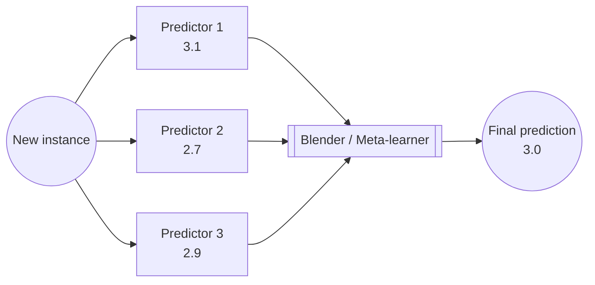
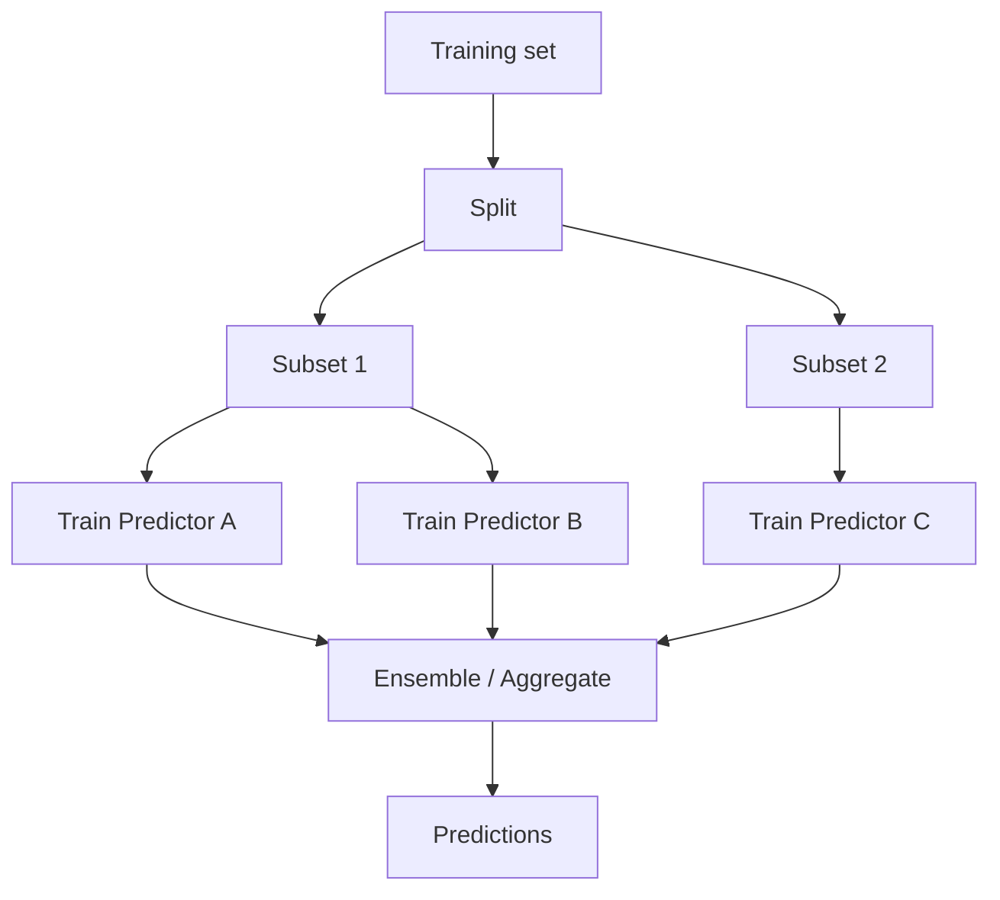
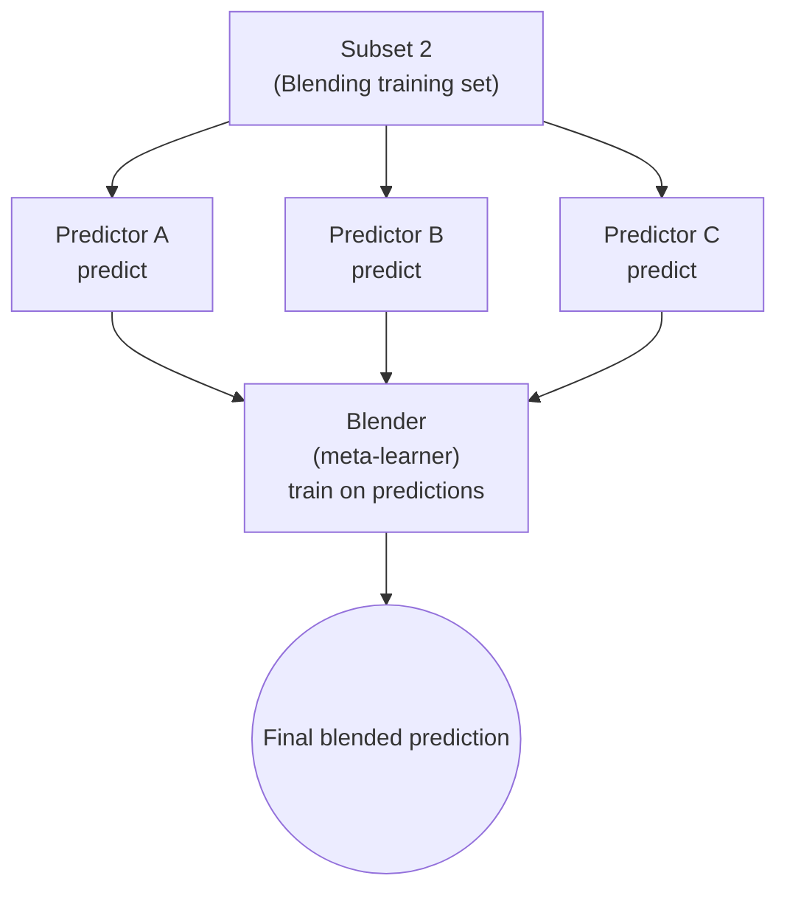

# Ensemble Learning and Random Forests

## Ensemble Learning
if you aggregate the predictions of a group of predictors (such as classifiers or regressors), you will often get better predictions than with the best individual predictor. 
A group of predictors is called an ensemble
technique is called ensemble learning

Ensemble Learning algorithm is called an Ensemble method

we will discuss some popular methods: bagging, boosting, stacking, random forest etc

## [Voting Classifiers](./voting-classifier.py)

u have few classifiers, Logistic Regression, an SVM, a Random Forest, a K-Nearest Neighbors, etc

more better way: aggregate all and predict the class that gets the most votes
This majority-vote classifier is called a hard voting classifier

even if classifier are weak, ensemble can still be strong

creates and trains a voting classifier in Scikit-Learn, composed of three diverse classifiers
```python
from sklearn.ensemble import RandomForestClassifier
from sklearn.ensemble import VotingClassifier
from sklearn.linear_model import LogisticRegression
from sklearn.svm import SVC
log_clf = LogisticRegression()
rnd_clf = RandomForestClassifier()
svm_clf = SVC()
voting_clf = VotingClassifier(
estimators=[('lr', log_clf), ('rf', rnd_clf), ('svc', svm_clf)],
voting='hard'
)
voting_clf.fit(X_train, y_train)
```

accuracy on test set
```sh
>>> from sklearn.metrics import accuracy_score
>>> for clf in (log_clf, rnd_clf, svm_clf, voting_clf):
>>> clf.fit(X_train, y_train)
>>> y_pred = clf.predict(X_test)
>>> print(clf.__class__.__name__, accuracy_score(y_test, y_pred))
LogisticRegression 0.864
RandomForestClassifier 0.872
SVC 0.888
VotingClassifier 0.896
```

outperforms all individual classifiers

soft voting classifiers: tell Scikit-Learn to predict the class with the highest class probability, averaged over all the individual classifiers.

all need to do is replace `voting="hard"` with `voting="soft"`

## Bagging & Pasting
another approach is to use the same training algorithm for every
predictor, but to train them on different random subsets of the training set

known as bagging

When sampling is performed without replacement, it is called pasting.

Once all predictors are trained, the ensemble can make a prediction for a new instance by simply aggregating the predictions of all predictors
aggregation function is typically the *statistical mode*

### [Bagging and Pasting in Scikit-Learn](./bagging.py)
```python
from sklearn.ensemble import BaggingClassifier
from sklearn.tree import DecisionTreeClassifier
bag_clf = BaggingClassifier(
DecisionTreeClassifier(), n_estimators=500, #500 decision tree classifiers
max_samples=100, bootstrap=True, n_jobs=-1  #100 training instances; n_jobs: number of CPU cores to use for training and predictions
#-1 means all
)
bag_clf.fit(X_train, y_train)
y_pred = bag_clf.predict(X_test)
```

ensemble’s predictions will likely generalize much better than the single Decision Tree’s predictions: the ensemble has a
comparable bias but a smaller variance

Overall, bagging often results in better models

### [Out of Bag Evaluation](./bagging-out.py)
a BaggingClassifier samples m(training set size) training instances with replacement

63% only sampled, 37% not sampled i.e. out-of-bag (oob) instances

set `oob_score=True` when creating a BaggingClassifier to request an automatic oob evaluation after training

### Random Patches and Random Subspaces
The BaggingClassifier class supports sampling the features as well. 

controlled by two hyperparameters: max_features and bootstrap_features. 

work same way as max_samples and bootstrap, but for feature sampling.
Thus, each predictor will be trained on a random subset of the input features.
useful when you are dealing with high-dimensional inputs (such as images). 
Sampling both training instances and features is called the Random Patches method.
7 Keeping all training instances (i.e., bootstrap=False and max_samples=1.0) but sampling features (i.e., bootstrap_features=True and/or max_features smaller than 1.0) is called the Random Subspaces method.


Sampling features results in even more predictor diversity, trading a bit more bias for a lower variance.

## [Random Forest](./random-forest.py)

a Random Forest is an ensemble of Decision Trees

trained via the bagging/pasting method, typically with max_samples set to the size of the training set

more convenient and optimized for Decision Trees

```python
from sklearn.ensemble import RandomForestClassifier
rnd_clf = RandomForestClassifier(n_estimators=500, max_leaf_nodes=16, n_jobs=-1)    #500 trees, limited to max 16 nodes; -1 means all cores
rnd_clf.fit(X_train, y_train)
y_pred_rf = rnd_clf.predict(X_test)
```

a RandomForestClassifier has all the hyperparameters of a DecisionTreeClassifier+BaggingClassifier

introduces extra randomness for tree
searches for the best feature among a random subset of features

### Extra Trees
forest of such extremely random trees is simply called an Extremely Randomized Trees ensemble(Extra Tree)
makes Extra-Trees much faster to train than regular Random Forests since finding the best possible threshold for each feature at every node is one of the most time-consuming tasks of growing a tree.

create via `ExtraTreesClassifier` class

### Feature importance
decision tree: root(important feature), leaf(unimportant)

possible to get an estimate of a feature’s importance by computing the average depth at which it appears across all trees in the fores

```python
from sklearn.datasets import load_iris
iris = load_iris()
rnd_clf = RandomForestClassifier(n_estimators=500, n_jobs=-1)
rnd_clf.fit(iris["data"], iris["target"])
for name, score in zip(iris["feature_names"], rnd_clf.feature_importances_):
    print(name, score)
```

```
sepal length (cm) 0.112492250999
sepal width (cm) 0.0231192882825
petal length (cm) 0.441030464364
petal width (cm) 0.423357996355
```

## Boosting
refers to any Ensemble method that can combine several weak learners into a strong learner.

idea: train predictors sequentially, each trying to correct its predecessor.
example: AdaBoost, Gradient Boosting

### [Adaptive Boosting(AdaBoost)](./AdaBoost.py)

new predictor increases it's attention than the previous one
hence new predictor focuses more on hard cases

- train a 1st base classifier, make predictions on datasets
- increase relative weight of misclassified training instances
- train 2nd classifier with updated weights
- repeat

```python
from sklearn.ensemble import AdaBoostClassifier
ada_clf = AdaBoostClassifier(
DecisionTreeClassifier(max_depth=1), n_estimators=200,
algorithm="SAMME.R", learning_rate=0.5
)
ada_clf.fit(X_train, y_train)
```

similar to gradient descent except that instead of tweaking a single predictor’s parameters to minimize a cost function, AdaBoost adds predictors to the ensemble, gradually making it better.

each instance weight $w^i$ set to $1/m$, train 1st predictor and compute weighted error rate $r \subscript 1$

**Equation 7-1. Weighted error rate of the jth predictor**

$$
r_j \;=\; \frac{\sum_{i=1}^{m} w^{(i)}\mathbf{1}\{\hat{y}_j^{(i)} \ne y^{(i)}\}}{\sum_{i=1}^{m} w^{(i)}}
$$

where $\hat{y}_j^{(i)}$ is the $j$th predictor's prediction for the $i$th instance.

**Equation 7-2. Predictor weight**

$$
\alpha_j \;=\; \eta \,\log\!\left(\frac{1 - r_j}{r_j}\right)
$$

**Equation 7-3. Weight update rule**

For $i = 1,2,\dots,m$,

$$
w^{(i)} \leftarrow
\begin{cases}
w^{(i)}, & \text{if }\hat{y}_j^{(i)} = y^{(i)},\\[6pt]
w^{(i)} \,\exp(\alpha_j), & \text{if }\hat{y}_j^{(i)} \ne y^{(i)}.
\end{cases}
$$

**Equation 7-4. AdaBoost predictions**

$$
\hat{y}(\mathbf{x}) \;=\; \operatorname{argmax}_k \sum_{j=1}^{N} \alpha_j\,\mathbf{1}\{\hat{y}_j(\mathbf{x}) = k\}
$$

where $N$ is the number of predictors.

### [Gradient Boosting](./gradient-boosting.py)

works by sequentially adding predictors to an ensemble, each one correcting its predecesso

but instead of tweaking the instance weights at every iteration like AdaBoost does, this method tries to fit the new predictor to the residual errors made by the previous predictor.

[**Gradient Tree Boosting, or Gradient Boosted Regression Trees (GBRT)**](./gradient-tree-boosting.py)
fit a DecisionTreeRegressor to the training set

```python
from sklearn.tree import DecisionTreeRegressor
tree_reg1 = DecisionTreeRegressor(max_depth=2)
tree_reg1.fit(X, y)

#train 2nd on 1st
y2 = y - tree_reg1.predict(X)
tree_reg2 = DecisionTreeRegressor(max_depth=2)
tree_reg2.fit(X, y2)

#3rd on 2nd
y3 = y2 - tree_reg2.predict(X)
tree_reg3 = DecisionTreeRegressor(max_depth=2)
tree_reg3.fit(X, y3)

#prediction by summing all 3
y_pred = sum(tree.predict(X_new) for tree in (tree_reg1, tree_reg2, tree_reg3))
```

more simple way:
```python
from sklearn.ensemble import GradientBoostingRegressor
gbrt = GradientBoostingRegressor(max_depth=2, n_estimators=3, learning_rate=1.0)
gbrt.fit(X, y)
```

learning_rate hyperparameter scales the contribution of each tree
if low then more tree needed, but prediction generalise better
regularization technique called shrinkage.

to find optimal number of trees, use early stopping
use the staged_predict() method: it returns an iterator over the predictions made by the ensemble at each stage of training

trains a GBRT ensemble with 120 trees, then measures the validation error at each stage of training to find the optimal number of trees, and finally trains another GBRT ensemble using the optimal number of trees
```python
import numpy as np
from sklearn.model_selection import train_test_split
from sklearn.metrics import mean_squared_error
X_train, X_val, y_train, y_val = train_test_split(X, y)
gbrt = GradientBoostingRegressor(max_depth=2, n_estimators=120)
gbrt.fit(X_train, y_train)
errors = [mean_squared_error(y_val, y_pred)
for y_pred in gbrt.staged_predict(X_val)]
bst_n_estimators = np.argmin(errors)
gbrt_best = GradientBoostingRegressor(max_depth=2,n_estimators=bst_n_estimators)
gbrt_best.fit(X_train, y_train)
```


## Stacking
 instead of using trivial functions (such as hard voting) to aggregate the predictions of all predictors in an ensemble, why don’t we train a model to perform this aggregation


Each of the bottom three predictors predicts a different value (3.1, 2.7, and 2.9), and then the final predictor (called a blender, or a meta learner) takes these predictions as inputs and makes the final prediction (3.0).



training 1st layer


training the blender

Each predictor makes predictions on the blending training set (held-out subsets). The blender (meta-learner) is then trained on those predictions to combine them.



Predictions in a multilayer stacking ensemble