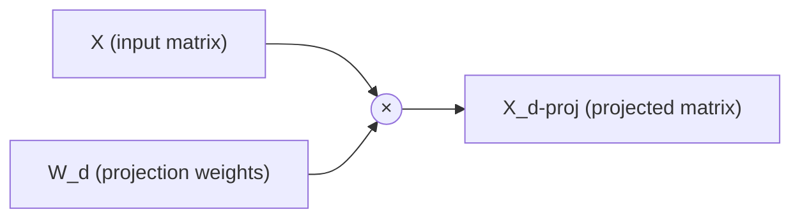

# Dimension Reduction

_Curse of Dimensionality:_ Thousands or even Millions of features for each training instance, this makes the training slow.

It is possible to reduce no of features hence intractable problems can be turned into tractable one.
For instance: we can drop te white pixels on border and we can merge 2 neighbouring pixel into one.

## Curse of Dimensionality

It is hard to imagine 4d cube, as we live in 3d space.
Things work differently in higher dimensions.

If you pick two points randomly in a unit square, the distance between these two points will be, on average, roughly 0.52.
If you pick two random points in a unit 3D cube, the average distance will be roughly 0.66.

High dimension dataset are `sparse`, hence new instance will be far away from training.

The more dimensions the training set has, the greater the risk of overfitting it.

## Approaches : Projection & Manifold Learning

**Projection**
Data is not evenly present as we know.
All training instances actually lie within(or close to) a much lower-dimensional subspace of the high-dimensional space.

Consider this: We trace points in 3d, then we can create a 2d plane where they all lie in same plane; like a sphere will make a circle.
But not always best approach.

**Manifold Learning**
So higher dimension object can create lower dimension object, like sphere can create a circle
d-dimensional manifold is a part of an n-dimensional space (where d < n)
Here algorithm works by modeling the manifold on which the training instances lie;

existing dataset like MNIST, they have some similarity as compared to human generated

swiss roll, 3d: spiral decision boundary line
swiss roll, 2d: straight decision boundary line

dimension reduce then training increases

### [PCA(Principal Component Analysis)](./pca.py)

1. Identify the hyperplane that lies closest to the data
2. Project the data onto the plane

**Principle Component**

- find axis that has max variance
- find 2nd axis that accounts for the largest amount of remaining variance.

Both axis are orthogonal to each other, hence they can repeat it for n times, like 3rd perpendicular to 1st,2nd etc

```python
X_centered = X - X.mean(axis=0)
U, s, V = np.linalg.svd(X_centered)
c1 = V.T[:, 0]
c2 = V.T[:, 1]
```

### Projecting Down to d Dimensions

First identify the principle components then reduce the dimension by projecting them.

Consider projecting 3d onto 2d; Sphere onto becomes a Circle.

Compute the dot product of the training set matrix X by the matrix Wd, defined as the matrix containing the first d principal components



```
X_proj=X \dot W_d
```

```python
W2 = V.T[:, :2]
X2D = X_centered.dot(W2)
```

```python
#via scikit
from sklearn.decomposition import PCA
pca = PCA(n_components = 2)
X2D = pca.fit_transform(X)
```

**Explained Variance Ratio**: It's proportion of the dataset’s variance that lies along the axis of each principal component

```python
print(pca.explained_variance_ratio_)
```

**Dimension Choosing**: Choosing the number of dimensions to reduce down to. It should add up to a sufficiently large portion of the variance

It preserves 95% variance:

```python
pca = PCA()
pca.fit(X)
cumsum = np.cumsum(pca.explained_variance_ratio_)
d = np.argmax(cumsum >= 0.95) + 1
```

Better option: Instead of specifying the number of principal components you want to preserve,
you can set n_components(ratio of variance to preserve) to be a float between 0.0 and 1.0:

```python
pca = PCA(n_components=0.95)
X_reduced = pca.fit_transform(X)
```

**PCA for Compression**
Apply PCA to MNIST dataset while preserving 95% of its variance.

It can transform back to original data by applying the inverse transformation of the PCA projection.
It is not exactly same as the variance was dropped, but will be quite similar.

_Reconstruction Error_ :Mean Squared Distance between the original data and the reconstructed data (compressed and then decompressed)

```python
pca = PCA(n_components = 154)
X_mnist_reduced = pca.fit_transform(X_mnist)    #784 to 154
X_mnist_recovered = pca.inverse_transform(X_mnist_reduced)  #154 to 784
```

**Incremental PCA**
Split the training set into mini-batches and feed an IPCA algorithm one mini-batch at a time.
use `partial_fit()` with each mini-batch rather than the fit() method with the whole training set

```python
from sklearn.decomposition import IncrementalPCA

n_batches = 100
inc_pca = IncrementalPCA(n_components=154)
for X_batch in np.array_split(X_mnist, n_batches):
    inc_pca.partial_fit(X_batch)

X_mnist_reduced = inc_pca.transform(X_mnist)
```

**Randomised PCA**

Stochastic Algorithm that quickly finds an approximation of the first d principal components.

Complexity : $$O(m × d^{2}) + O(d^{3})$$

```python
rnd_pca = PCA(n_components=154, svd_solver="randomized")
X_reduced = rnd_pca.fit_transform(X_mnist)
```

**Kernel PCA**

It performs complex nonlinear projections for dimensionality reduction.

```python
from sklearn.decomposition import KernelPCA
rbf_pca = KernelPCA(n_components = 2, kernel="rbf", gamma=0.04)
X_reduced = rbf_pca.fit_transform(X)
```

select a kernel and tune hyperparameters

```python
from sklearn.model_selection import GridSearchCV
from sklearn.linear_model import LogisticRegression
from sklearn.pipeline import Pipeline
clf = Pipeline([
("kpca", KernelPCA(n_components=2)),
("log_reg", LogisticRegression())
])
param_grid = [{
"kpca__gamma": np.linspace(0.03, 0.05, 10),
"kpca__kernel": ["rbf", "sigmoid"]
}]
grid_search = GridSearchCV(clf, param_grid, cv=3)
grid_search.fit(X, y)
print(grid_search.best_params_)
# {'kpca__gamma': 0.043333333333333335, 'kpca__kernel': 'rbf'}
```

alter:

```python
rbf_pca = KernelPCA(n_components = 2, kernel="rbf",     #rbf kernel selected
gamma=0.0433,
fit_inverse_transform=True)
X_reduced = rbf_pca.fit_transform(X)
X_preimage = rbf_pca.inverse_transform(X_reduced)
```

### Locally Linear Embedding/LLE

Working Mech:

1. Measure how each training instance linearly relates to its closest neighbors.
2. Look for a low-dimensional representation of the training set where these local relationships are best preserved

```python
from sklearn.manifold import LocallyLinearEmbedding
lle = LocallyLinearEmbedding(n_components=2, n_neighbors=10)
X_reduced = lle.fit_transform(X)
```

Distances are not preserved on a larger scale: the left part of the unrolled Swiss roll is squeezed, while the right part is stretched.
