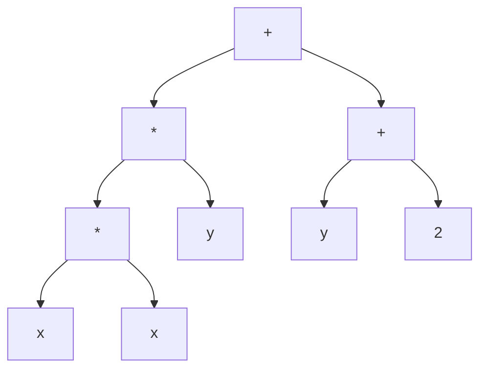

# TenserFlow
open source software library for numerical computation, and fine tuned for large scale machine learning

1st define in Python a graph of computations to perform
2nd TensorFlow takes that graph and runs it efficiently using optimized C++ code

$f(x,y)=x^{2}*y+y+2$
break this down into a computation graph
then you convert that graph to c++



also supports distributed computing, so you can train colossal neural networks on
humongous training sets in a reasonable amount of time by splitting the computations across hundreds of servers

we can train a network with millions of parameters on a training set composed of billions of instances with millions of features each.

designed to be flexible, scalable, and production-ready, and existing frameworks arguably hit only two out of the three of these.

- runs on every device
- simple flexible python API [TF.Learn](tensorflow.contrib.learn) compatible with scikit
- several high-level API built on top of it, like Keras, Pretty Tensor etc
- automatic differentiating (or autodiff): auto handles computing gradients of functions.
- TensorBoard: visualisation tool to browse through the computation graph, view learning curves, and more.

## Installation
```sh
source env/bin/activate
pip3 install --upgrade tensorflow
```

## [1st Graph](./tf-graph.py)
```python
import tensorflow as tf
x = tf.Variable(3, name="x")
y = tf.Variable(4, name="y")
f = x*x*y + y + 2

#creates a session, initializes the variables,and evaluates, and f then closes the session
sess = tf.Session()
sess.run(x.initializer)
sess.run(y.initializer)
result = sess.run(f)
print(result)   #42
sess.close()

#instead of sess.run() everytime, do:
with tf.Session() as sess:
    x.initializer.run() # equivalent to calling tf.get_default_session().run(x.initializer)
    y.initializer.run()
    result = f.eval()   # equivalent to calling tf.get_default_session().run(f)

#manually calling every variable, use alt: global_variables_initializer()
init = tf.global_variables_initializer() # prepare an init node
with tf.Session() as sess:
    init.run() # actually initialize all the variables
    result = f.eval()
```

tensor flow program has 2 parts:
- 1st: build a computation graph(construction phase)
- 2nd: run it(execution phase)

## Managing Graphs
can create a graph directly and add nodes:
```python
x1 = tf.Variable(1)
x1.graph is tf.get_default_graph()  #true
```

multiple graphs:
```python
graph = tf.Graph()

# creating a new Graph and temporarily making it the default graph inside a with block
with graph.as_default():
... x2 = tf.Variable(2)
...


x2.graph is graph   #True
>>> x2.graph is tf.get_default_graph()  #False
```

## Lifecycle of a Node Value
```python
w = tf.constant(3)
x = w + 2
y = x + 5
z = x * 3

with tf.Session() as sess:
    print(y.eval()) # 10
    print(z.eval()) # 15
```

start a grph, y depends on w, that on x
so evaluate w, then x, then y, return y, then return z
preceding code evaluates w and x twice

to avoid twice evaluation:
```python
with tf.Session() as sess:
    y_val, z_val = sess.run([y, z])
    print(y_val) # 10
    print(z_val) # 15
```

## [Linear Regression with TensorFlow](./tf-reg.py)

- 1. TensorFlow ops take any number of inputs and produce outputs; constants/variables are source ops (no inputs).
- 2. Inputs/outputs are tensors (multidimensional arrays) with a dtype and shape (represented as NumPy ndarrays in the Python API).
- 3. Building the graph only creates nodes (no computation); matrix ops like `transpose`, `matmul`, `matrix_inverse` define nodes.
- 4. To execute computations you run the graph in a `Session`; sessions evaluate tensors and return concrete NumPy arrays.
- 5. Example: implement the Normal Equation with TensorFlow constants and matrix ops, then evaluate `theta` in a session.

```python
import numpy as np
from sklearn.datasets import fetch_california_housing

housing = fetch_california_housing()
m, n = housing.data.shape
housing_data_plus_bias = np.c_[np.ones((m, 1)), housing.data]

X = tf.constant(housing_data_plus_bias, dtype=tf.float32, name="X")
y = tf.constant(housing.target.reshape(-1, 1), dtype=tf.float32, name="y")
XT = tf.transpose(X)
theta = tf.matmul(tf.matmul(tf.matrix_inverse(tf.matmul(XT, X)), XT), y)

with tf.Session() as sess:
    theta_value = theta.eval()
```

## [Implementing Gradient Descent](./tf-gra-des.py)

### Manual
```python
n_epochs = 1000
learning_rate = 0.01

X = tf.constant(scaled_housing_data_plus_bias, dtype=tf.float32, name="X")
y = tf.constant(housing.target.reshape(-1, 1), dtype=tf.float32, name="y")
theta = tf.Variable(tf.random_uniform([n + 1, 1], -1.0, 1.0), name="theta")
#random_uniform() function creates a node in graph that gnrt a tensor containing random values, given its shape and value range,
y_pred = tf.matmul(X, theta, name="predictions")
error = y_pred - y
mse = tf.reduce_mean(tf.square(error), name="mse")
gradients = 2/m * tf.matmul(tf.transpose(X), error)
training_op = tf.assign(theta, theta - learning_rate * gradients)
#assign create a node that assign new value to variable

init = tf.global_variables_initializer()

with tf.Session() as sess:
    sess.run(init)
    #execute teaining step over and over
    for epoch in range(n_epochs):
        if epoch % 100 == 0:
            print("Epoch", epoch, "MSE =", mse.eval())
        sess.run(training_op)

best_theta = theta.eval()
```

### Using AutoDiff
well optimise algos, like f(x)=exp(exp(exp(x))) and f'(x)=exp(x) × exp(exp(x)) × exp(exp(exp(x)))
if you code them separately, not efficient
efficient: write a function that first computes exp(x), then exp(exp(x)), then exp(exp(exp(x))), and returns all three.

```python
def my_func(a, b):
    z = 0
    for i in range(100):
        z = a * np.cos(z + i) + z * np.sin(b - i)
    return z
```

### Using Optimiser
```python
optimizer = tf.train.GradientDescentOptimizer(learning_rate=learning_rate)
training_op = optimizer.minimize(mse)

#diff optimiser
optimizer = tf.train.MomentumOptimizer(learning_rate=learning_rate, momentum=0.9)
```

## Feeding Data to Training Algorithm
use placeholder nodes to just output the data you tell them to output at runtime
used to pass the training data to TensorFlow during training.
```python
>>> A = tf.placeholder(tf.float32, shape=(None, 3))
>>> B = A + 5
>>> with tf.Session() as sess:
... B_val_1 = B.eval(feed_dict={A: [[1, 2, 3]]})
... B_val_2 = B.eval(feed_dict={A: [[4, 5, 6], [7, 8, 9]]})
...
>>> print(B_val_1)
[[ 6. 7. 8.]]
>>> print(B_val_2)
[[ 9. 10. 11.]
[ 12. 13. 14.]]
```

[mini-batch gradient descent](./batch-gradient-descent.py)

## Saving & Restoring Models

just save a model to reuse it later
```python
[...]
theta = tf.Variable(tf.random_uniform([n + 1, 1], -1.0, 1.0), name="theta")
[...]
init = tf.global_variables_initializer()
saver = tf.train.Saver()

with tf.Session() as sess:
    sess.run(init)

    for epoch in range(n_epochs):
        if epoch % 100 == 0: # checkpoint every 100 epochs
            save_path = saver.save(sess, "/tmp/my_model.ckpt")

        sess.run(training_op)

best_theta = theta.eval()
save_path = saver.save(sess, "/tmp/my_model_final.ckpt")

#restoring the model
with tf.Session() as sess:
saver.restore(sess, "/tmp/my_model_final.ckpt")
```

## Visualizing the Graph and Training Curves Using TensorBoard
use TensorBoard to show interactive visualisation
```python
from datetime import datetime
now = datetime.utcnow().strftime("%Y%m%d%H%M%S")
root_logdir = "tf_logs"
logdir = "{}/run-{}/".format(root_logdir, now)

#add at end of construction phase
mse_summary = tf.summary.scalar('MSE', mse)
file_writer = tf.summary.FileWriter(logdir, tf.get_default_graph())

#evaluate node regulation while training
for batch_index in range(n_batches):
    X_batch, y_batch = fetch_batch(epoch, batch_index, batch_size)
    if batch_index % 10 == 0:
        summary_str = mse_summary.eval(feed_dict={X: X_batch, y: y_batch})
        step = epoch * n_batches + batch_index
        file_writer.add_summary(summary_str, step)
    sess.run(training_op, feed_dict={X: X_batch, y: y_batch})
file_writer.close()
```

to run:
```bash
source env/bin/activate
tensorboard --logdir tf_logs/
```

runs at `http://0.0.0.0:6006/`

## Name Scopes
just name the group of nodes for future ref
```python
with tf.name_scope("loss") as scope:
    error = y_pred - y
    mse = tf.reduce_mean(tf.square(error), name="mse")
```

## Modularity

create a graph that adds the output of two rectified linear units
ReLU: linear function of the inputs, and outputs the result if it is positive, and 0 otherwise


```python
n_features = 3
X = tf.placeholder(tf.float32, shape=(None, n_features), name="X")
w1 = tf.Variable(tf.random_normal((n_features, 1)), name="weights1")
w2 = tf.Variable(tf.random_normal((n_features, 1)), name="weights2")
b1 = tf.Variable(0.0, name="bias1")
b2 = tf.Variable(0.0, name="bias2")
z1 = tf.add(tf.matmul(X, w1), b1, name="z1")
z2 = tf.add(tf.matmul(X, w2), b2, name="z2")
relu1 = tf.maximum(z1, 0., name="relu1")
relu2 = tf.maximum(z1, 0., name="relu2")
output = tf.add(relu1, relu2, name="output")
```

optimise to:
```python
def relu(X):
    w_shape = (int(X.get_shape()[1]), 1)
    w = tf.Variable(tf.random_normal(w_shape), name="weights")
    b = tf.Variable(0.0, name="bias")
    z = tf.add(tf.matmul(X, w), b, name="z")
    return tf.maximum(z, 0., name="relu")

n_features = 3
X = tf.placeholder(tf.float32, shape=(None, n_features), name="X")
relus = [relu(X) for i in range(5)]
output = tf.add_n(relus, name="output")
```


u can also share variables