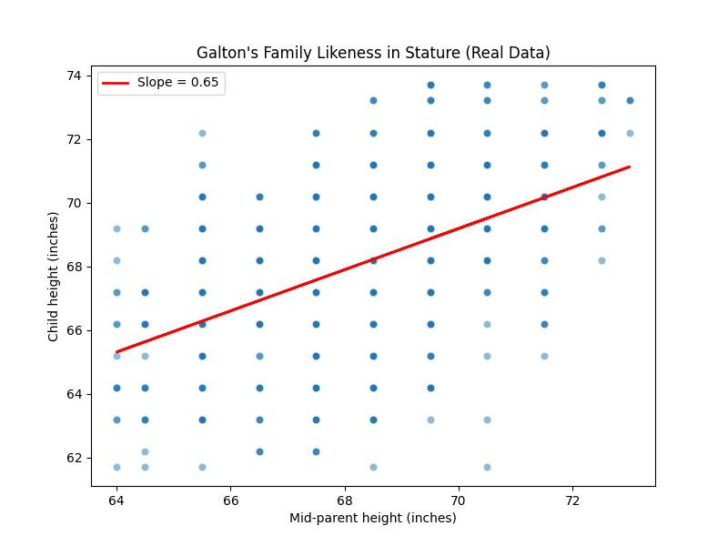

# [Linear Regression](https://galton.org/essays/1880-1889/galton-1886-family-likeness-stature.pdf)

read the 1st paper , well here is summary of what i read, understood and learnt

well Francis Galton wanted to quantify how physical traits (like height) are inherited.
Not just “tall parents → tall kids,” but how much tallness carries over statistically.

he was obessed with the idea,
He chose stature (height) because:

- It’s measurable with high precision,
- It’s stable in adults,
- And there was already a lot of data on it.

## Setup

He collected data as:

- Heights of 205 families, ~930 children.
- Heights of 783 brothers across 295 families.
- Converted all female heights to “male equivalents” (×1.08 multiplier) so the whole dataset could be treated uniformly.

He plotted distributions of height as ogives — basically cumulative curves of how many people are below a given height.

He then defined:

- Mean: average stature in population.
- Quartile Deviation (p): half the difference between upper and lower quartiles — a measure of spread (like SD but for quartiles).

## Heart of Paper

Galton noticed that:

```
Children of tall parents tend to be tall, but not as tall as their parents.
Likewise, children of short parents are short, but not as short.
```

He called this phenomenon **“regression toward mediocrity.”**

He quantified it:

- Plot **mid-parent** height (average of father & mother) vs child height.
- Fit a straight line through the points.

He found:

> The slope ≈ 2/3.

Meaning:

- If parents are 3 inches taller than average, their children are ~2 inches taller than average (on average).
- That’s regression coefficient = 2/3.

That simple ratio is what we now call the regression coefficient.
Hence concept was invented.

# Formula

Galton wanted a general mathematical law linking relatives’ heights.

He introduces:

`p`: the quartile deviation in the population.

`f`: the quartile deviation within a kinship group (e.g., among brothers).

`w`: the “ratio of regression” — how strongly relatives resemble each other.

His core relationship:

$$
w^2 p^2 + f^2 = p^2
$$

variation among relatives + regression effect still reproduces the total population variance.

He found empirically:

$$
p \approx 1.7"
$$

$$
w = \frac{2}{3}
$$

$$
f \approx 1.27"
$$

He repeated this for siblings, uncles, grandparents, etc., estimating how resemblance weakens as genetic distance increases.

**the closer the relation, the steeper the regression slope**, but never 1:1.

## 5. The Conceptual Breakthrough

Galton realized:
Even though _traits_ are heritable, _variation persists_ because inheritance is **blended**, not exact.

He saw heredity as statistical, not deterministic : a revolutionary idea in 1886.

His “regression” concept introduced:

- **Regression line** (average relation between two variables),
- **Correlation** (formalized later by Karl Pearson, Galton’s mentee),
- The birth of **statistical heredity models** → foundation of quantitative genetics.

So every modern regression equation(even ML linear regression) descends conceptually from this paper.

---

##  6. The Appendix (by J.D. Hamilton Dickson)

This part extends Galton’s intuition into **geometry**:

- He visualizes frequency distributions as **surfaces in 3D space** - height frequency vs. stature of one relative vs. another.
- Cross-sections of this surface are **ellipses of correlation**.

That geometric insight became the modern **bivariate normal distribution** and **correlation ellipse**.
It’s literally the first time correlation was visualized in mathematical space.

---

# Limitations & Biases

Galton’s work was genius, but also primitive in some ways:

- He assumed height followed a perfect normal distribution.
- His dataset was small and not fully representative.
- He blended male/female data by a crude ratio (1.08).
- And he over generalised “regression to the mean” into heredity of all traits which later fueled eugenic arguments.

Still, the math itself was clean and sound hence _the concept survived_.

a mere implementation of same is [here](./linear-reg-galton.py)

same thing generates the below given image:


